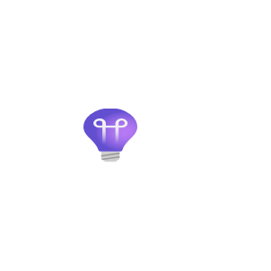
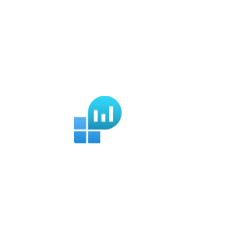
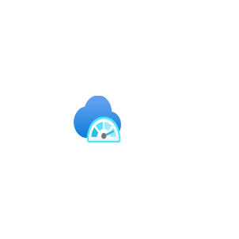

# Azure2 Monitor Entities

- [ActivityLog](./activity-log.md)  

- [ApplicationInsights](./application-insights.md)  

- [ChangeAnalysis](./change-analysis.md)  

- [DiagnosticsSettings](./diagnostics-settings.md)  

- [LogAnalyticsWorkspaces](./log-analytics-workspaces.md)  

- [MetricsAdvisor](./metrics-advisor.md)  

- [Monitor](./monitor.md)  

- [NetworkWatcher](./network-watcher.md)  

- [SapAzureMonitor](./sap-azure-monitor.md)  

- [Scale](./scale.md)  

- [Workbooks](./workbooks.md)  

