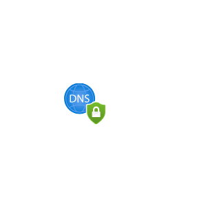
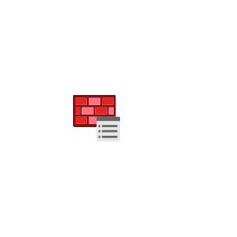

# Azure2 Networking Entities

- [ApplicationGatewayContainers](./application-gateway-containers.md)  

- [ApplicationGateways](./application-gateways.md)  

- [AtmMultistack](./atm-multistack.md)  

- [Bastions](./bastions.md)  

- [CdnProfiles](./cdn-profiles.md)  

- [CommunicationsGateway](./communications-gateway.md)  

- [ConnectedCache](./connected-cache.md)  

- [Connections](./connections.md)  

- [DdosProtectionPlans](./ddos-protection-plans.md)  

- [DnsMultistack](./dns-multistack.md)  

- [DnsPrivateResolver](./dns-private-resolver.md)  

- [DnsSecurityPolicy](./dns-security-policy.md)  

- [DnsZones](./dns-zones.md)  

- [ExpressrouteCircuits](./expressroute-circuits.md)  

- [FirewallManager](./firewall-manager.md)  

- [FirewallPolicy](./firewall-policy.md)  

- [Firewalls](./firewalls.md)  

- [FrontDoors](./front-doors.md)  

- [IpAddressManager](./ip-address-manager.md)  

- [IpGroups](./ip-groups.md)  

- [LoadBalancerHub](./load-balancer-hub.md)  

- [LoadBalancers](./load-balancers.md)  

- [LocalNetworkGateways](./local-network-gateways.md)  

- [Nat](./nat.md)  

- [NetworkInterfaces](./network-interfaces.md)  

- [NetworkSecurityGroups](./network-security-groups.md)  

- [NetworkWatcher](./network-watcher.md)  

- [OnPremisesDataGateways](./on-premises-data-gateways.md)  

- [PrivateEndpoint](./private-endpoint.md)  

- [PrivateLink](./private-link.md)  

- [PrivateLinkHub](./private-link-hub.md)  

- [PrivateLinkService](./private-link-service.md)  

- [ProximityPlacementGroups](./proximity-placement-groups.md)  

- [PublicIpAddresses](./public-ip-addresses.md)  

- [PublicIpAddressesClassic](./public-ip-addresses-classic.md)  

- [PublicIpPrefixes](./public-ip-prefixes.md)  

- [ReservedIpAddressesClassic](./reserved-ip-addresses-classic.md)  

- [ResourceManagementPrivateLink](./resource-management-private-link.md)  

- [RouteFilters](./route-filters.md)  

- [RouteTables](./route-tables.md)  

- [ServiceEndpointPolicies](./service-endpoint-policies.md)  

- [SpotVm](./spot-vm.md)  

- [SpotVmss](./spot-vmss.md)  

- [Subnet](./subnet.md)  

- [TrafficManagerProfiles](./traffic-manager-profiles.md)  

- [VirtualNetworkGateways](./virtual-network-gateways.md)  

- [VirtualNetworks](./virtual-networks.md)  

- [VirtualNetworksClassic](./virtual-networks-classic.md)  

- [VirtualRouter](./virtual-router.md)  

- [VirtualWanHub](./virtual-wan-hub.md)  

- [VirtualWans](./virtual-wans.md)  

- [WebApplicationFirewallPoliciesWaf](./web-application-firewall-policies-waf.md)  

