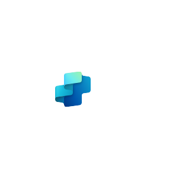
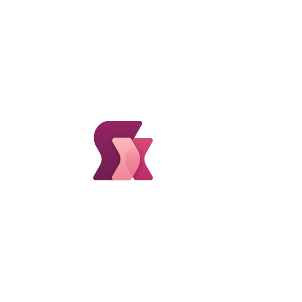
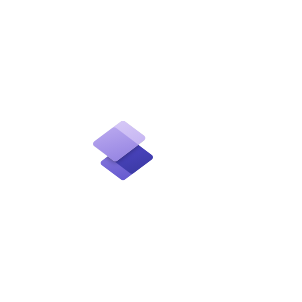

# Azure2 Power Platform Entities

- [AiBuilder](./ai-builder.md)  

- [CopilotStudio](./copilot-studio.md)  

- [Dataverse](./dataverse.md)  

- [Powerapps](./powerapps.md)  

- [Powerautomate](./powerautomate.md)  

- [Powerbi](./powerbi.md)  

- [Powerfx](./powerfx.md)  

- [Powerpages](./powerpages.md)  

- [Powerplatform](./powerplatform.md)  

