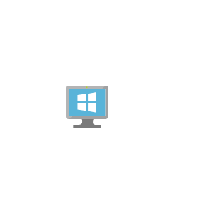
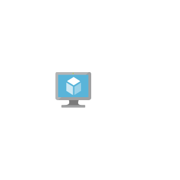

# Cae Compute Service VM Entities

- [AvailabilitySets](./availability-sets.md)  

- [NonAzureMachine](./non-azure-machine.md)  

- [OsImagesClassic](./os-images-classic.md)  

- [Vm](./vm.md)  

- [VmLinuxNonAzure](./vm-linux-non-azure.md)  

- [VmLinux](./vm-linux.md)  

- [VmWindowsNonAzure](./vm-windows-non-azure.md)  

- [VmWindows](./vm-windows.md)  

- [Vm2](./vm-2.md)  

- [VmScaleSets](./vm-scale-sets.md)  

