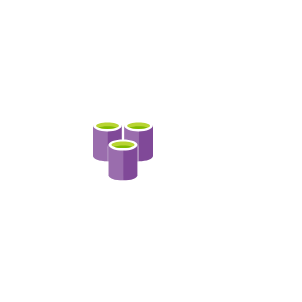

# Cae Databases Service Entities

- [AzureCacheForRedis](./azure-cache-for-redis.md)  

- [AzureDatabaseForMariadbServers](./azure-database-for-mariadb-servers.md)  

- [AzureDatabaseForMysqlServers](./azure-database-for-mysql-servers.md)  

- [AzureDatabaseForPostgresqlServers](./azure-database-for-postgresql-servers.md)  

- [AzureSqlDatawarehouse](./azure-sql-datawarehouse.md)  

- [BlobStorage](./blob-storage.md)  

- [CachePlusRedis](./cache-plus-redis.md)  

- [Cosmosdb](./cosmosdb.md)  

- [DataLake](./data-lake.md)  

- [DatabaseGeneric](./database-generic.md)  

- [ElasticDatabasePools](./elastic-database-pools.md)  

- [ElasticJobAgents](./elastic-job-agents.md)  

- [ManagedDatabases](./managed-databases.md)  

- [SqlDatabases](./sql-databases.md)  

- [SqlManagedInstances](./sql-managed-instances.md)  

- [SqlServerStretchDb](./sql-server-stretch-db.md)  

- [SqlServers](./sql-servers.md)  

- [VirtualClusters](./virtual-clusters.md)  

- [VirtualDatacenter](./virtual-datacenter.md)  

