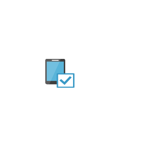

# Device Compliance

## Definition

```js
{
  _style: {
    entity: 'image;sketch=0;aspect=fixed;html=1;points=[];align=center;fontSize=12;image=img/lib/mscae/Device_Compliance.svg;strokeColor=none;',
  },
  _original_width: 41,
  _original_height: 50,

}
```

## Usage

```js
import { DeviceCompliance } from '@dinghy/standard-components-diagrams/caeIntuneService'

<DeviceCompliance/>
```

## Preview


