# Cisco Data Center Entities

- [Aci](./aci.md)  

- [BladeServerColor](./blade-server-color.md)  
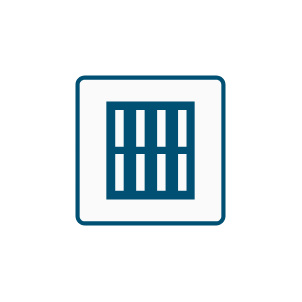

- [BladeServerSubdued](./blade-server-subdued.md)  
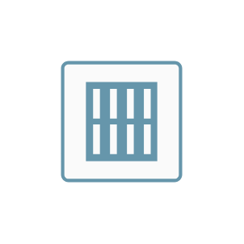

- [DatabaseRelational](./database-relational.md)  

- [DnsServer](./dns-server.md)  
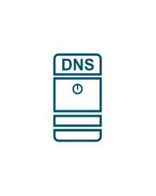

- [FabricInterconnect](./fabric-interconnect.md)  

- [FibreChannelDirectorMds9000](./fibre-channel-director-mds-9000.md)  

- [FibreChannelFabricSwitch](./fibre-channel-fabric-switch.md)  
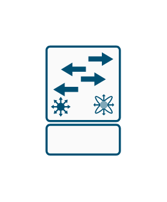

- [Hypervisor](./hypervisor.md)  

- [Layer3Nexus5kSwitch](./layer-3-nexus-5k-switch.md)  
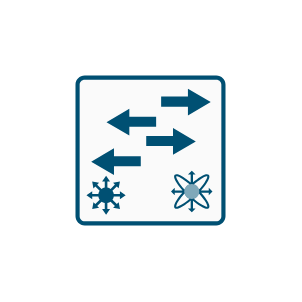

- [Nexus1010](./nexus-1010.md)  

- [Nexus1k](./nexus-1k.md)  
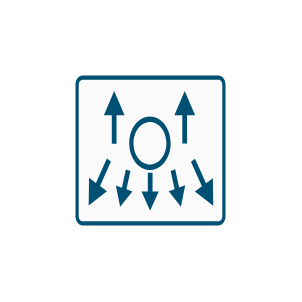

- [Nexus1kvVsm](./nexus-1kv-vsm.md)  
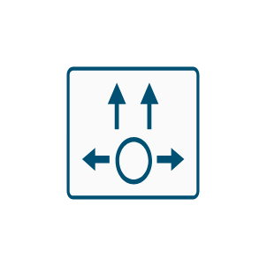

- [Nexus200010ge](./nexus-2000-10ge.md)  
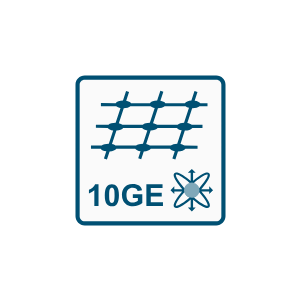

- [Nexus2k](./nexus-2k.md)  

- [Nexus3k](./nexus-3k.md)  
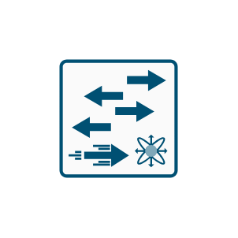

- [Nexus4k](./nexus-4k.md)  

- [Nexus5k](./nexus-5k.md)  
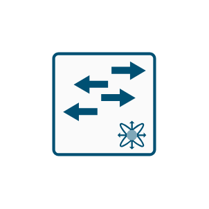

- [Nexus5kWithIntegratedVsm](./nexus-5k-with-integrated-vsm.md)  
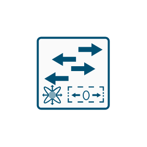

- [Nexus7k](./nexus-7k.md)  
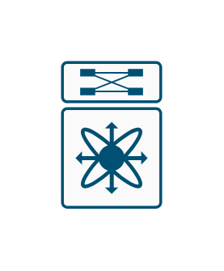

- [Nexus9300](./nexus-9300.md)  

- [Nexus9500](./nexus-9500.md)  

- [Rps](./rps.md)  

- [SecureServer](./secure-server.md)  

- [Server](./server.md)  

- [Storage](./storage.md)  

- [Ucs5108BladeChassis](./ucs-5108-blade-chassis.md)  
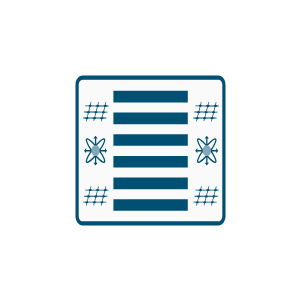

- [UcsCSeriesServer](./ucs-c-series-server.md)  
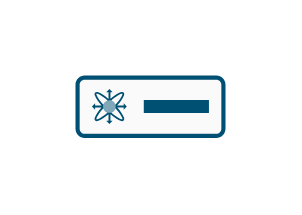

- [Ups](./ups.md)  

- [VirtualMatrixSwitch](./virtual-matrix-switch.md)  

- [Vts](./vts.md)  

- [X509Certificate](./x-509-certificate.md)  

