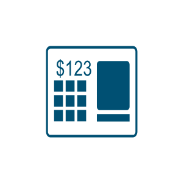

# Cisco Endpoint Client and Device Icons Entities

- [Branch](./branch.md)  

- [CellPhone](./cell-phone.md)  

- [DataCenter](./data-center.md)  

- [Handheld](./handheld.md)  

- [HomeOffice](./home-office.md)  

- [Laptop](./laptop.md)  

- [Pos](./pos.md)  

- [Printer](./printer.md)  

- [SecureEndpointLaptop](./secure-endpoint-laptop.md)  

- [SecureEndpointPc](./secure-endpoint-pc.md)  

- [Tablet](./tablet.md)  

- [User](./user.md)  

- [Workstation](./workstation.md)  

