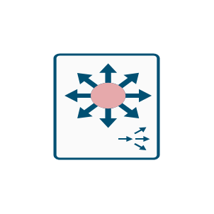

# L3 Modular 3

## Definition

```js
{
  _style: {
    entity: 'sketch=0;points=[[0.015,0.015,0],[0.985,0.015,0],[0.985,0.985,0],[0.015,0.985,0],[0.25,0,0],[0.5,0,0],[0.75,0,0],[1,0.25,0],[1,0.5,0],[1,0.75,0],[0.75,1,0],[0.5,1,0],[0.25,1,0],[0,0.75,0],[0,0.5,0],[0,0.25,0]];verticalLabelPosition=bottom;html=1;verticalAlign=top;aspect=fixed;align=center;pointerEvents=1;shape=mxgraph.cisco19.rect;prIcon=6500_vss2;fillColor=#FAFAFA;strokeColor=#005073;',
  },
  _original_width: 50,
  _original_height: 65,

}
```

## Usage

```js
import { L3Modular3 } from '@dinghy/standard-components-diagrams/cisco19LanSwitching'

<L3Modular3/>
```

## Preview


