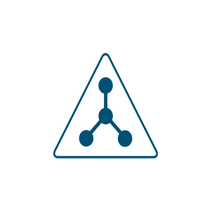

# Cisco Security, Clouds and Connectors Entities

- [Acs](./acs.md)  

- [Asa5500](./asa-5500.md)  

- [CiscoSecurityManager](./cisco-security-manager.md)  

- [Cloud](./cloud.md)  

- [Cloud2](./cloud-2.md)  

- [Cloud3](./cloud-3.md)  

- [Cloud4](./cloud-4.md)  

- [Cloud5](./cloud-5.md)  

- [EmailSecurity](./email-security.md)  

- [Firewall](./firewall.md)  

- [IpsIds](./ips-ids.md)  

- [Ironport](./ironport.md)  

- [Ise](./ise.md)  

- [Key](./key.md)  

- [Ldap](./ldap.md)  

- [Lock](./lock.md)  

- [NacAppliance](./nac-appliance.md)  

- [SecureEndpointLaptop](./secure-endpoint-laptop.md)  

- [SecurityManagementColor](./security-management-color.md)  

- [SecurityManagementSubdued](./security-management-subdued.md)  

- [SslTerminator](./ssl-terminator.md)  

- [VpnConcentrator](./vpn-concentrator.md)  

- [WebSecurity](./web-security.md)  

