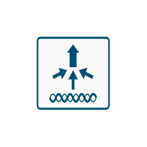

# Cisco Wireless LAN Entities

- [Component3g4gIndicator](./component-3g-4g-indicator.md)  

- [DualModeAccessPoint](./dual-mode-access-point.md)  

- [MeshAccessPoint](./mesh-access-point.md)  

- [WifiIndicator](./wifi-indicator.md)  

- [WirelessAcessPoint](./wireless-acess-point.md)  

- [WirelessBridge](./wireless-bridge.md)  

- [WirelessLanController](./wireless-lan-controller.md)  

- [WirelessLocationAppliance](./wireless-location-appliance.md)  

