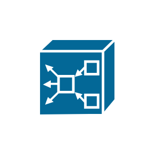

# MAS Gateway

## Definition

```js
{
  _style: {
    entity: 'shape=mxgraph.cisco.hubs_and_gateways.mas_gateway;sketch=0;html=1;pointerEvents=1;dashed=0;fillColor=#036897;strokeColor=#ffffff;strokeWidth=2;verticalLabelPosition=bottom;verticalAlign=top;align=center;outlineConnect=0;',
  },
  _original_width: 58,
  _original_height: 59,

}
```

## Usage

```js
import { MasGateway } from '@dinghy/standard-components-diagrams/ciscoHubsAndGateways'

<MasGateway/>
```

## Preview


