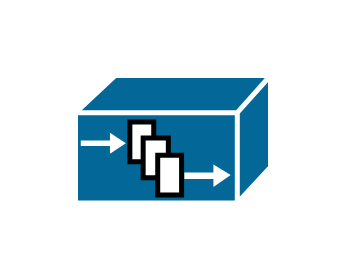

# IPTV Content Manager

## Definition

```js
{
  _style: {
    entity: 'shape=mxgraph.cisco.misc.iptv_content_manager;sketch=0;html=1;pointerEvents=1;dashed=0;fillColor=#036897;strokeColor=#ffffff;strokeWidth=2;verticalLabelPosition=bottom;verticalAlign=top;align=center;outlineConnect=0;',
  },
  _width: 78,
  _height: 51,
}
```

## Usage

```js
import { IptvContentManager } from '@dinghy/standard-components-diagrams/ciscoMisc'

<IptvContentManager/>
```

## Preview


