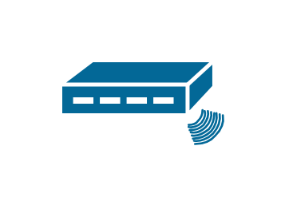

# Cisco Modems and Phones Entities

- [CableModem](./cable-modem.md)  

- [CellPhone](./cell-phone.md)  

- [Fax](./fax.md)  

- [Hootphone](./hootphone.md)  

- [IpPhone](./ip-phone.md)  

- [MobileAccessIpPhone](./mobile-access-ip-phone.md)  

- [Modem](./modem.md)  

- [Phone](./phone.md)  

- [PhoneFax](./phone-fax.md)  

- [RfModem](./rf-modem.md)  

- [Softphone](./softphone.md)  

