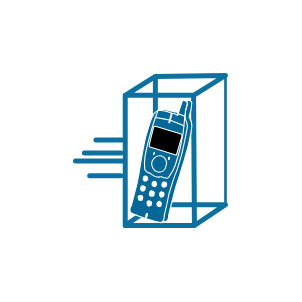

# Mobile Access IP Phone

## Definition

```js
{
  _style: {
    entity: 'shape=mxgraph.cisco.modems_and_phones.mobile_access_ip_phone;sketch=0;html=1;pointerEvents=1;dashed=0;fillColor=#036897;strokeColor=#ffffff;strokeWidth=2;verticalLabelPosition=bottom;verticalAlign=top;align=center;outlineConnect=0;',
  },
  _original_width: 90,
  _original_height: 80,

}
```

## Usage

```js
import { MobileAccessIpPhone } from '@dinghy/standard-components-diagrams/ciscoModemsAndPhones'

<MobileAccessIpPhone/>
```

## Preview


