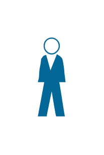
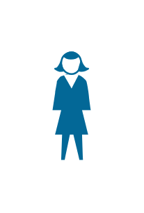

# Cisco People Entities

- [AndrogenousPerson](./androgenous-person.md)  

- [MacWoman](./mac-woman.md)  

- [ManWoman](./man-woman.md)  

- [PcMan](./pc-man.md)  

- [RunningMan](./running-man.md)  

- [SittingWoman](./sitting-woman.md)  

- [StandingMan](./standing-man.md)  

- [StandingWoman](./standing-woman.md)  

