# Cisco Design Entities

- [AccessPoint](./access-point.md)  

- [AccessSwitch](./access-switch.md)  

- [AciController](./aci-controller.md)  
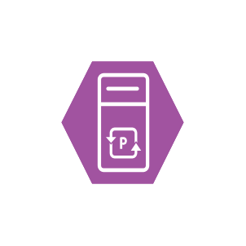

- [AciController2](./aci-controller-2.md)  
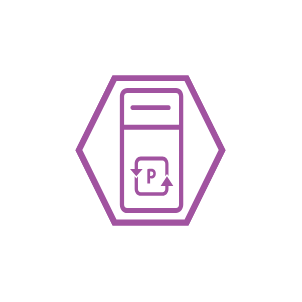

- [AciLeafSwitch](./aci-leaf-switch.md)  

- [AciSpineSwitch](./aci-spine-switch.md)  
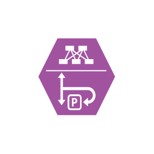

- [ActorFemale](./actor-female.md)  

- [ActorMale](./actor-male.md)  

- [Actuator](./actuator.md)  

- [AdaptiveSecurityAppliance](./adaptive-security-appliance.md)  

- [AdaptiveSecurityAppliance2](./adaptive-security-appliance-2.md)  
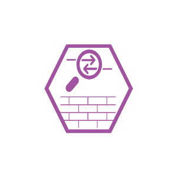

- [AutomatedSystem](./automated-system.md)  

- [BladeServer](./blade-server.md)  
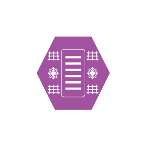

- [BladeServer2](./blade-server-2.md)  
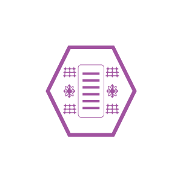

- [BlankDevice](./blank-device.md)  

- [BlankService](./blank-service.md)  

- [CallManager](./call-manager.md)  
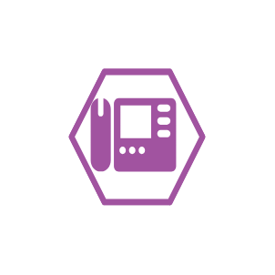

- [CatalystDataCenterSwitch](./catalyst-data-center-switch.md)  
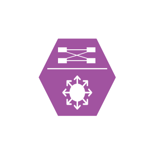

- [CatalystSwitchStack](./catalyst-switch-stack.md)  

- [CiscoAmp](./cisco-amp.md)  

- [CiscoAnyconnect](./cisco-anyconnect.md)  
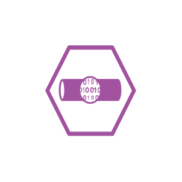

- [CiscoCloudWebSecurity](./cisco-cloud-web-security.md)  

- [ClientFirewall](./client-firewall.md)  

- [CoreSwitch](./core-switch.md)  

- [CorporateDevice](./corporate-device.md)  

- [DdosProtection](./ddos-protection.md)  
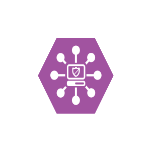

- [DdosProtection2](./ddos-protection-2.md)  
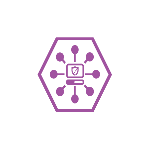

- [DistributionSwitch](./distribution-switch.md)  
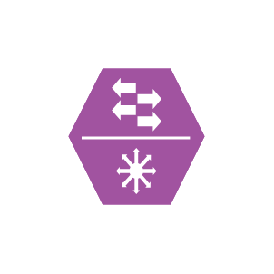

- [EmailSecurity](./email-security.md)  

- [EncryptionOffload](./encryption-offload.md)  
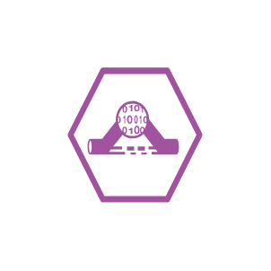

- [EndpointConcentrator](./endpoint-concentrator.md)  

- [EndpointConcentrator2](./endpoint-concentrator-2.md)  

- [FabricSwitch](./fabric-switch.md)  

- [FirepowerAppliance](./firepower-appliance.md)  
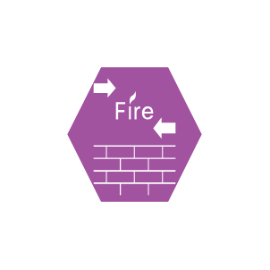

- [FirepowerAppliance2](./firepower-appliance-2.md)  
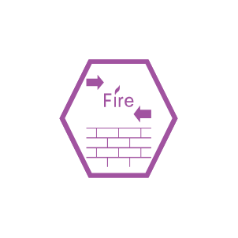

- [FirepowerManagementCenter](./firepower-management-center.md)  

- [FirepowerManagementCenter2](./firepower-management-center-2.md)  
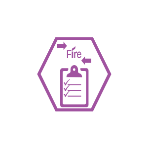

- [Firewall](./firewall.md)  

- [Firewall2](./firewall-2.md)  
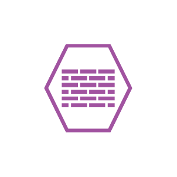

- [FlowCollector](./flow-collector.md)  
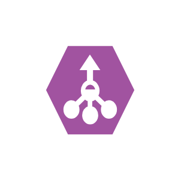

- [FlowCollector2](./flow-collector-2.md)  
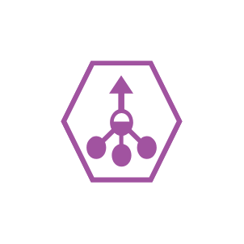

- [FlowSensor](./flow-sensor.md)  

- [FlowSensor2](./flow-sensor-2.md)  

- [IdentityDirectory](./identity-directory.md)  

- [IntrusionPrevention](./intrusion-prevention.md)  

- [IntrusionPrevention2](./intrusion-prevention-2.md)  

- [L2Switch](./l2-switch.md)  

- [LoadBalancer](./load-balancer.md)  

- [LoadBalancer2](./load-balancer-2.md)  
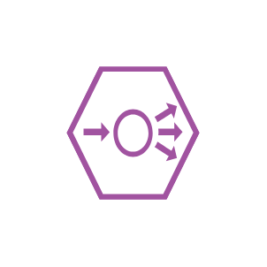

- [LogCollector](./log-collector.md)  
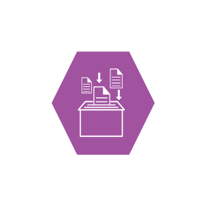

- [LogCollector2](./log-collector-2.md)  
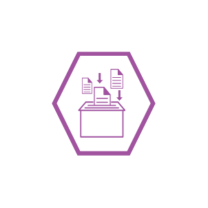

- [ManagementConsole](./management-console.md)  

- [ManagementConsole2](./management-console-2.md)  

- [Mdm](./mdm.md)  

- [Mdm2](./mdm-2.md)  
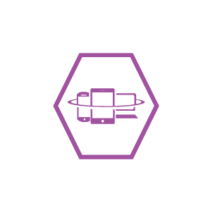

- [MobileDevice](./mobile-device.md)  

- [Monitoring](./monitoring.md)  

- [Monitoring2](./monitoring-2.md)  

- [MsActiveDirectory](./ms-active-directory.md)  
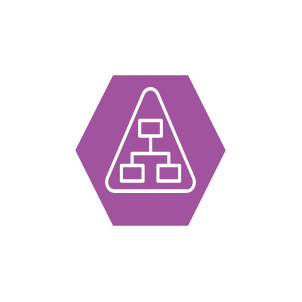

- [MsActiveDirectory2](./ms-active-directory-2.md)  
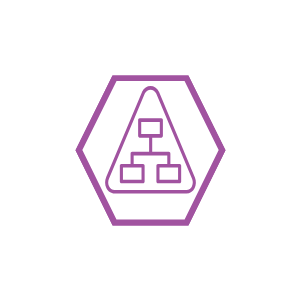

- [Nexus1kv](./nexus-1kv.md)  
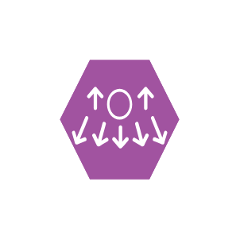

- [NexusDataCenterSwitch](./nexus-data-center-switch.md)  
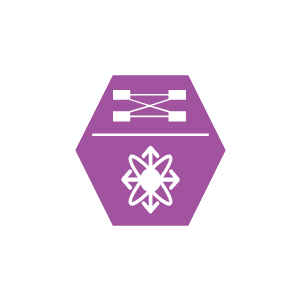

- [NexusFabricSwitch](./nexus-fabric-switch.md)  
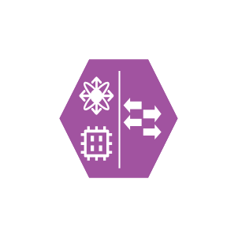

- [NexusSwitch](./nexus-switch.md)  
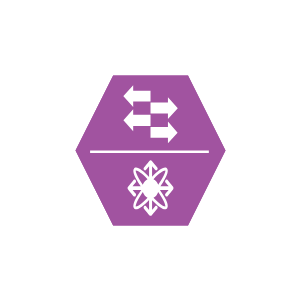

- [Ntp](./ntp.md)  

- [Ntp2](./ntp-2.md)  

- [Phone](./phone.md)  

- [Policy](./policy.md)  

- [Policy2](./policy-2.md)  

- [RadwareAppliance](./radware-appliance.md)  

- [RadwareAppliance2](./radware-appliance-2.md)  

- [Router](./router.md)  

- [Router2](./router-2.md)  

- [SdWan](./sd-wan.md)  

- [SdWan2](./sd-wan-2.md)  

- [SecureDns](./secure-dns.md)  
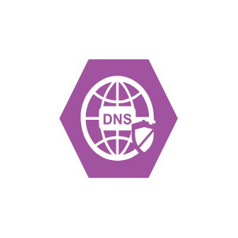

- [SecureDns2](./secure-dns-2.md)  
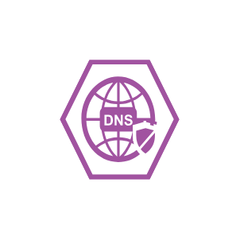

- [Sensor](./sensor.md)  
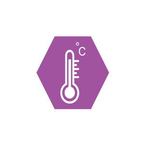

- [Server](./server.md)  
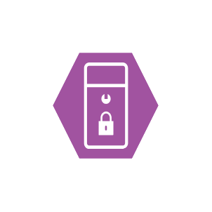

- [Server2](./server-2.md)  
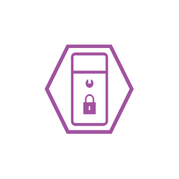

- [Server3](./server-3.md)  
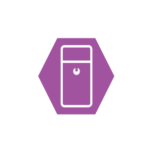

- [Server4](./server-4.md)  
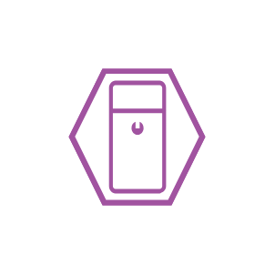

- [Siem](./siem.md)  

- [Siem2](./siem-2.md)  

- [Storage](./storage.md)  

- [Storage2](./storage-2.md)  

- [SwitchStack](./switch-stack.md)  
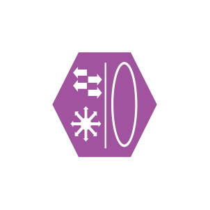

- [TetrationAgent](./tetration-agent.md)  
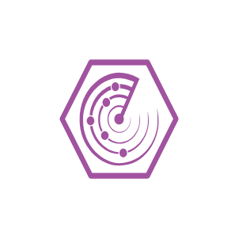

- [TlsAppliance](./tls-appliance.md)  

- [UdpDirector](./udp-director.md)  
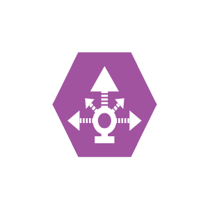

- [UdpDirector2](./udp-director-2.md)  
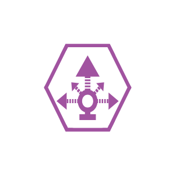

- [User](./user.md)  

- [Users](./users.md)  

- [VideoEndpoint](./video-endpoint.md)  

- [VirtualSecureServer](./virtual-secure-server.md)  
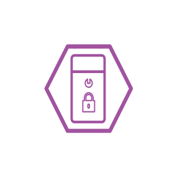

- [VloadBalancer](./vload-balancer.md)  
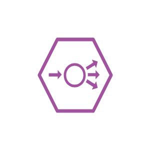

- [VpnConcentrator](./vpn-concentrator.md)  
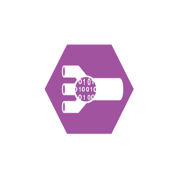

- [VpnConcentrator2](./vpn-concentrator-2.md)  
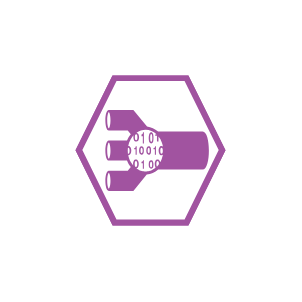

- [VulnerabilityManagement](./vulnerability-management.md)  
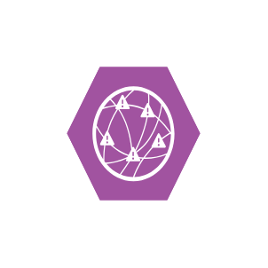

- [VulnerabilityManagement2](./vulnerability-management-2.md)  
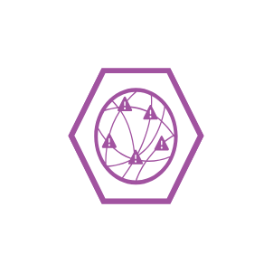

- [VwafSecurity](./vwaf-security.md)  
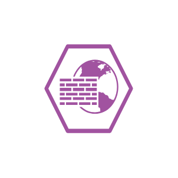

- [VwebSecurity](./vweb-security.md)  

- [VwlanController](./vwlan-controller.md)  
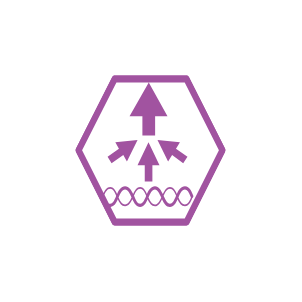

- [WebApplicationFirewall](./web-application-firewall.md)  
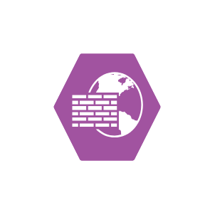

- [WebApplicationFirewall2](./web-application-firewall-2.md)  
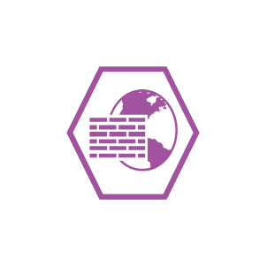

- [WebFiltering](./web-filtering.md)  

- [WebFiltering2](./web-filtering-2.md)  

- [WebSecurity](./web-security.md)  

- [WideAreaApplicationEngine](./wide-area-application-engine.md)  

- [WideAreaApplicationEngine2](./wide-area-application-engine-2.md)  

- [WirelessCorporateDevice](./wireless-corporate-device.md)  

- [WirelessLanController](./wireless-lan-controller.md)  

- [WirelessSwitch](./wireless-switch.md)  

