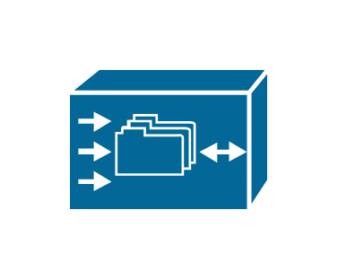

# Cisco File Engine

## Definition

```js
{
  _style: {
    entity: 'shape=mxgraph.cisco.storage.cisco_file_engine;sketch=0;html=1;pointerEvents=1;dashed=0;fillColor=#036897;strokeColor=#ffffff;strokeWidth=2;verticalLabelPosition=bottom;verticalAlign=top;align=center;outlineConnect=0;',
  },
  _width: 90,
  _height: 64,
}
```

## Usage

```js
import { CiscoFileEngine } from '@dinghy/standard-components-diagrams/ciscoStorage'

<CiscoFileEngine/>
```

## Preview


