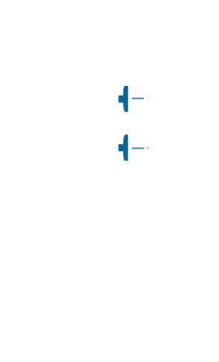

# Cisco Wireless Entities

- [Antenna](./antenna.md)  

- [GroundTerminal](./ground-terminal.md)  

- [RadioTower](./radio-tower.md)  

- [Satellite](./satellite.md)  

- [SatelliteDish](./satellite-dish.md)  

- [WiFiTag](./wi-fi-tag.md)  

- [Wireless](./wireless.md)  

- [WirelessBridge](./wireless-bridge.md)  

- [WirelessLocationAppliance](./wireless-location-appliance.md)  

- [WirelessTransport](./wireless-transport.md)  

- [WlanController](./wlan-controller.md)  

