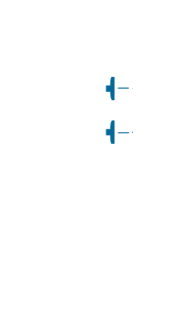

# Radio Tower

## Definition

```js
{
  _style: {
    entity: 'shape=mxgraph.cisco.wireless.radio_tower;sketch=0;html=1;pointerEvents=1;dashed=0;fillColor=#036897;strokeColor=#ffffff;strokeWidth=2;verticalLabelPosition=bottom;verticalAlign=top;align=center;outlineConnect=0;',
  },
  _width: 37,
  _height: 101,
}
```

## Usage

```js
import { RadioTower } from '@dinghy/standard-components-diagrams/ciscoWireless'

<RadioTower/>
```

## Preview


