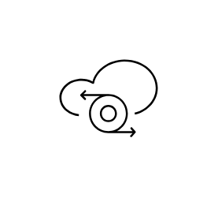

# VDA Upgrade Service

## Definition

```js
{
  _style: {
    entity: 'sketch=0;verticalLabelPosition=bottom;sketch=0;aspect=fixed;html=1;verticalAlign=top;strokeColor=none;fillColor=#000000;align=center;outlineConnect=0;pointerEvents=1;shape=mxgraph.citrix2.vda_upgrade_service;',
  },
  _width: 50,
  _height: 39.395,
}
```

## Usage

```js
import { VdaUpgradeService } from '@dinghy/standard-components-diagrams/citrixCloudServices'

<VdaUpgradeService/>
```

## Preview


