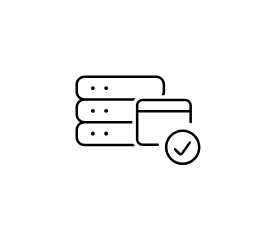

# Citrix Components Entities

- [AppGroup](./app-group.md)  

- [AppProtection](./app-protection.md)  

- [Beacon](./beacon.md)  

- [CitrixApp](./citrix-app.md)  

- [CitrixAppLayering](./citrix-app-layering.md)  

- [CitrixFederatedAuthenticationService](./citrix-federated-authentication-service.md)  

- [CitrixLicenseServer](./citrix-license-server.md)  

- [CitrixPolicies](./citrix-policies.md)  

- [CitrixProvisioningServer](./citrix-provisioning-server.md)  

- [CitrixSessionRecordingServer](./citrix-session-recording-server.md)  

- [CitrixTerraformProvider](./citrix-terraform-provider.md)  

- [CitrixUberAgent](./citrix-uber-agent.md)  

- [DeliveryController](./delivery-controller.md)  

- [DeliveryGroup](./delivery-group.md)  

- [Director](./director.md)  

- [HypervisorXenserver](./hypervisor-xenserver.md)  

- [ImagePortabilityService](./image-portability-service.md)  

- [MachineCatalog](./machine-catalog.md)  

- [NetscalerGateway](./netscaler-gateway.md)  

- [SecurePrivateAccess](./secure-private-access.md)  

- [SiteDatabase](./site-database.md)  

- [Storefront](./storefront.md)  

- [StudioWebStudio](./studio-web-studio.md)  

- [Vda](./vda.md)  

- [WorkspaceEnvironmentManagement](./workspace-environment-management.md)  

- [XenserverConsole](./xenserver-console.md)  

- [Zones](./zones.md)  

