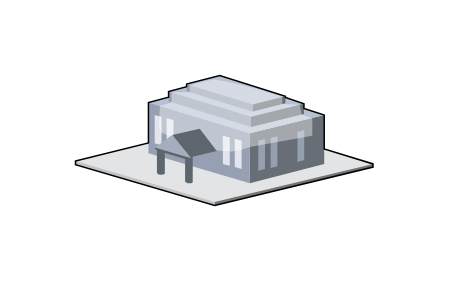

# Government

## Definition

```js
{
  _style: {
    entity: 'verticalLabelPosition=bottom;sketch=0;aspect=fixed;html=1;verticalAlign=top;strokeColor=none;align=center;outlineConnect=0;shape=mxgraph.citrix.government;',
  },
  _width: 119,
  _height: 52,
}
```

## Usage

```js
import { Government } from '@dinghy/standard-components-diagrams/citrixLegacy'

<Government/>
```

## Preview


