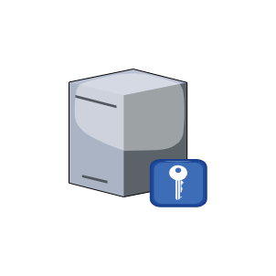

# Radius Server

## Definition

```js
{
  _style: {
    entity: 'verticalLabelPosition=bottom;sketch=0;aspect=fixed;html=1;verticalAlign=top;strokeColor=none;align=center;outlineConnect=0;shape=mxgraph.citrix.radius_server;',
  },
  _original_width: 75.5,
  _original_height: 91,

}
```

## Usage

```js
import { RadiusServer } from '@dinghy/standard-components-diagrams/citrixLegacy'

<RadiusServer/>
```

## Preview


