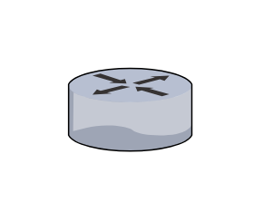

# Router

## Definition

```js
{
  _style: {
    entity: 'verticalLabelPosition=bottom;sketch=0;aspect=fixed;html=1;verticalAlign=top;strokeColor=none;align=center;outlineConnect=0;shape=mxgraph.citrix.router;',
  },
  _width: 55,
  _height: 36.5,
}
```

## Usage

```js
import { Router } from '@dinghy/standard-components-diagrams/citrixLegacy'

<Router/>
```

## Preview


