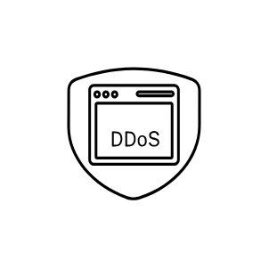
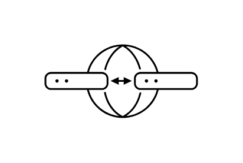
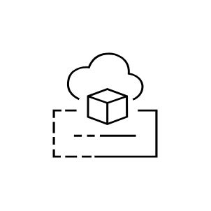
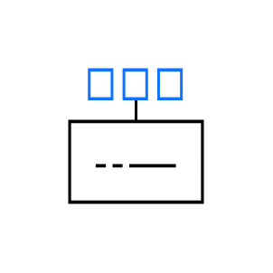
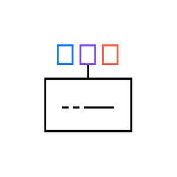
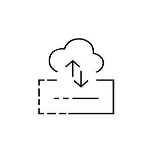
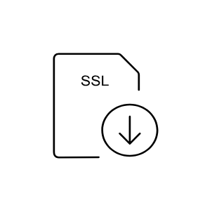
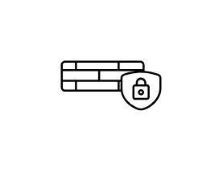

# Citrix NetScaler Entities

- [ApiProtection](./api-protection.md)  

- [BotMitigation](./bot-mitigation.md)  

- [DdosProtection](./ddos-protection.md)  

- [Gslb](./gslb.md)  

- [LoadBalancing](./load-balancing.md)  

- [NetscalerBlx](./netscaler-blx.md)  

- [NetscalerCpx](./netscaler-cpx.md)  

- [NetscalerGateway](./netscaler-gateway.md)  

- [NetscalerMpx](./netscaler-mpx.md)  

- [NetscalerSdx](./netscaler-sdx.md)  

- [NetscalerVpx](./netscaler-vpx.md)  

- [SslTlsOffloading](./ssl-tls-offloading.md)  

- [Waf](./waf.md)  

