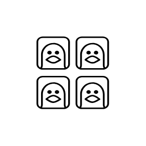

# Linux Apps

## Definition

```js
{
  _style: {
    entity: 'sketch=0;verticalLabelPosition=bottom;sketch=0;aspect=fixed;html=1;verticalAlign=top;strokeColor=none;fillColor=#000000;align=center;outlineConnect=0;pointerEvents=1;shape=mxgraph.citrix2.linux_apps;',
  },
  _original_width: 42.714999999999996,
  _original_height: 50,

}
```

## Usage

```js
import { LinuxApps } from '@dinghy/standard-components-diagrams/citrixResources'

<LinuxApps/>
```

## Preview


