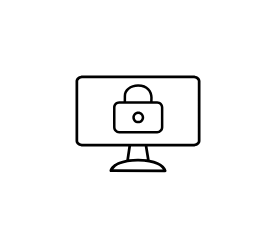

# Citrix Users and Devices Entities

- [Admins](./admins.md)  

- [Desktop](./desktop.md)  

- [Devices](./devices.md)  

- [ExternalUsers](./external-users.md)  

- [InternalUsers](./internal-users.md)  

- [Laptop](./laptop.md)  

- [ManagedDesktop](./managed-desktop.md)  

- [MobilePhone](./mobile-phone.md)  

- [Tablet](./tablet.md)  

- [ThinClient](./thin-client.md)  

- [User](./user.md)  

- [Users](./users.md)  

