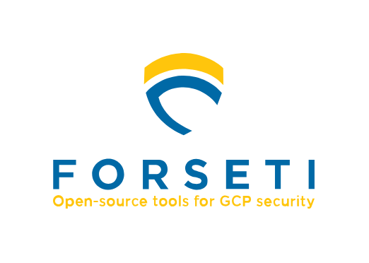
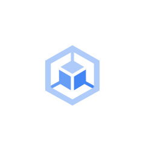
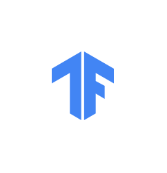
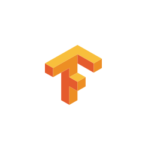

# Gcp Icons Open Source Icons Entities

- [ForsetiLockup](./forseti-lockup.md)  

- [ForsetiSecurity](./forseti-security.md)  

- [IstioLogo](./istio-logo.md)  

- [KubernetesEngine](./kubernetes-engine.md)  

- [KubernetesLogo](./kubernetes-logo.md)  

- [KubernetesName](./kubernetes-name.md)  

- [Tensorflow](./tensorflow.md)  

- [TensorflowLogo](./tensorflow-logo.md)  

