# Gcp2 General Icons Entities

- [A7Power](./a7-power.md)  

- [Admin](./admin.md)  
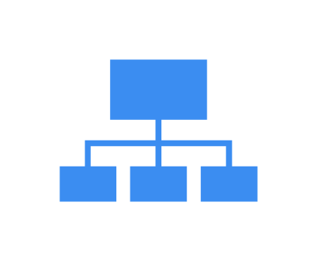

- [AdminConnected](./admin-connected.md)  
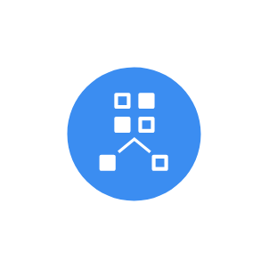

- [AnomalyDetection](./anomaly-detection.md)  

- [ArrowCycle](./arrow-cycle.md)  

- [ArrowsSystem](./arrows-system.md)  
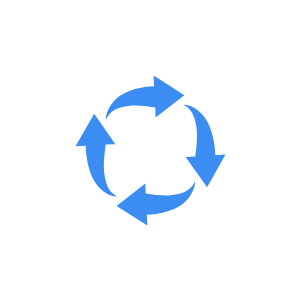

- [AspectRatio](./aspect-ratio.md)  

- [BigQuery](./big-query.md)  

- [BiomedicalBeaker](./biomedical-beaker.md)  

- [BiomedicalTestTube](./biomedical-test-tube.md)  

- [BiomedicalTrio](./biomedical-trio.md)  

- [BucketScale](./bucket-scale.md)  

- [Calculator](./calculator.md)  
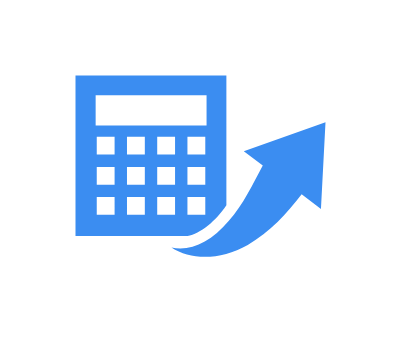

- [Capabilities](./capabilities.md)  

- [CertifiedIndustryStandard](./certified-industry-standard.md)  

- [Check](./check.md)  

- [CheckGreen](./check-green.md)  

- [CheckYellow](./check-yellow.md)  

- [Check2](./check-2.md)  

- [Check3](./check-3.md)  

- [CheckAvailable](./check-available.md)  

- [CheckScale](./check-scale.md)  
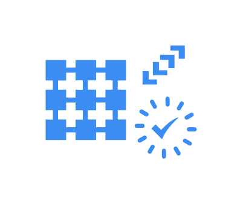

- [Clock](./clock.md)  

- [Cloud](./cloud.md)  
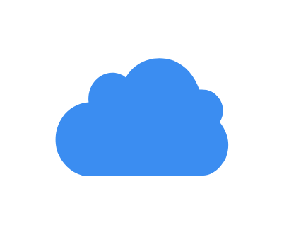

- [CloudCheckmark](./cloud-checkmark.md)  

- [CloudComputer](./cloud-computer.md)  

- [CloudConnectedInsight](./cloud-connected-insight.md)  

- [CloudInformationPortable](./cloud-information-portable.md)  
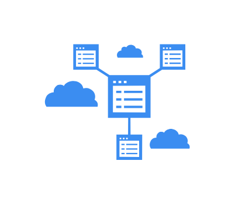

- [CloudMessaging](./cloud-messaging.md)  

- [CloudMonitoring](./cloud-monitoring.md)  

- [CloudSecurity](./cloud-security.md)  

- [CloudServer](./cloud-server.md)  

- [ComputeEngine](./compute-engine.md)  

- [CostArrows](./cost-arrows.md)  

- [CostFile](./cost-file.md)  

- [CostSavings](./cost-savings.md)  

- [DataAccess](./data-access.md)  

- [DataIncrease](./data-increase.md)  

- [DataStorageCost](./data-storage-cost.md)  

- [Database](./database.md)  

- [Database2](./database-2.md)  
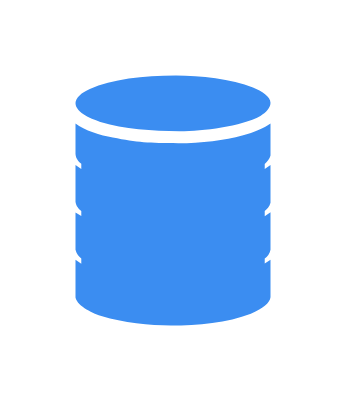

- [DatabaseCycle](./database-cycle.md)  
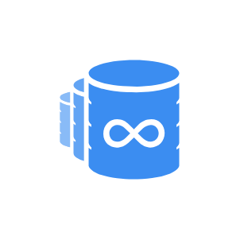

- [DatabaseSpeed](./database-speed.md)  
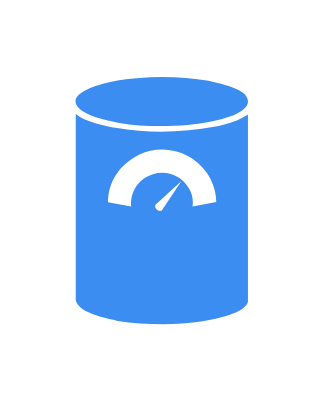

- [DatabaseUploading](./database-uploading.md)  

- [EnhanceUi](./enhance-ui.md)  

- [EnhanceUi2](./enhance-ui-2.md)  

- [ExternalDataCenter](./external-data-center.md)  

- [ExternalDataResource](./external-data-resource.md)  

- [Files](./files.md)  

- [Folders](./folders.md)  

- [Gear](./gear.md)  

- [GearArrow](./gear-arrow.md)  
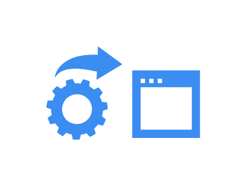

- [GearChain](./gear-chain.md)  

- [GearLoad](./gear-load.md)  

- [GoogleNetwork](./google-network.md)  

- [HalfCloud](./half-cloud.md)  

- [ImagesService](./images-service.md)  
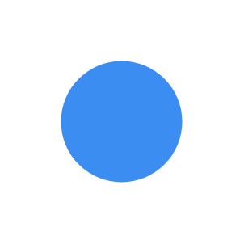

- [IncreaseCostArrows](./increase-cost-arrows.md)  

- [InternetConnection](./internet-connection.md)  

- [Key](./key.md)  

- [LegacyCloud](./legacy-cloud.md)  

- [LegacyCloud2](./legacy-cloud-2.md)  
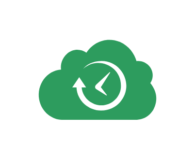

- [Lifecycle](./lifecycle.md)  

- [LoadBalancing](./load-balancing.md)  
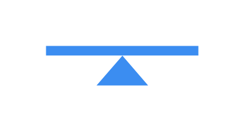

- [Loading](./loading.md)  

- [Loading2](./loading-2.md)  

- [Loading3](./loading-3.md)  

- [Lock](./lock.md)  

- [ManagementSecurity](./management-security.md)  

- [MapsApi](./maps-api.md)  

- [MemInstances](./mem-instances.md)  
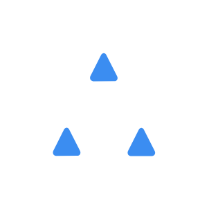

- [MemoryCard](./memory-card.md)  
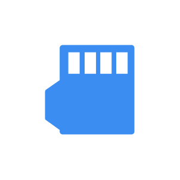

- [Monitor](./monitor.md)  

- [Monitor2](./monitor-2.md)  

- [Network](./network.md)  

- [Node](./node.md)  

- [Overtime](./overtime.md)  

- [PeopleSecurityManagement](./people-security-management.md)  

- [Phone](./phone.md)  

- [PlayGear](./play-gear.md)  

- [PlayStart](./play-start.md)  

- [Primary](./primary.md)  

- [Process](./process.md)  

- [ReplicationController](./replication-controller.md)  

- [ReplicationController2](./replication-controller-2.md)  

- [ReplicationController3](./replication-controller-3.md)  
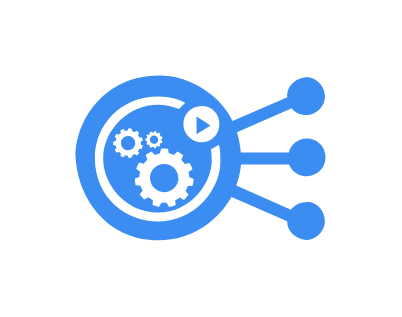

- [Repository](./repository.md)  
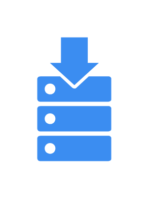

- [Repository2](./repository-2.md)  
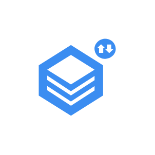

- [Repository3](./repository-3.md)  

- [Repository4](./repository-4.md)  
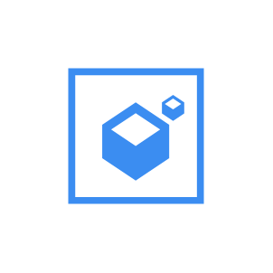

- [Safety](./safety.md)  

- [Save](./save.md)  

- [Search](./search.md)  

- [SearchGreen](./search-green.md)  

- [SearchApi](./search-api.md)  

- [Segments](./segments.md)  

- [Segments2](./segments-2.md)  

- [SegmentsOverlap](./segments-overlap.md)  

- [ServersStacked](./servers-stacked.md)  

- [Service](./service.md)  

- [SocialMediaTime](./social-media-time.md)  

- [Solution](./solution.md)  

- [Speed](./speed.md)  
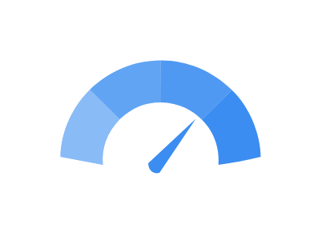

- [StackedOwnership](./stacked-ownership.md)  
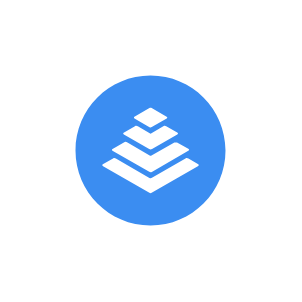

- [Swap](./swap.md)  
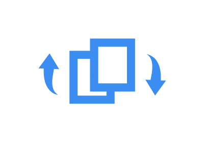

- [SystemsCheck](./systems-check.md)  

- [TapeRecord](./tape-record.md)  

- [TaskQueues](./task-queues.md)  
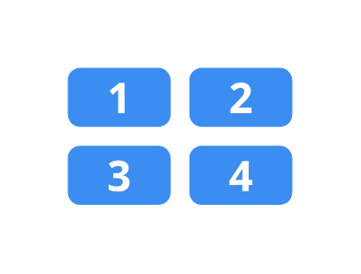

- [ThumbsUp](./thumbs-up.md)  

- [ViewList](./view-list.md)  

- [Visibility](./visibility.md)  

- [Vpn](./vpn.md)  

- [Website](./website.md)  

- [WorldNetwork](./world-network.md)  

