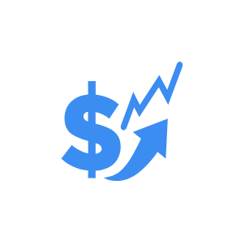

# Increase Cost Arrows

## Definition

```js
{
  _style: {
    entity: 'sketch=0;html=1;aspect=fixed;strokeColor=none;shadow=0;fillColor=#3B8DF1;verticalAlign=top;labelPosition=center;verticalLabelPosition=bottom;shape=mxgraph.gcp2.increase_cost_arrows',
  },
  _original_width: 100,
  _original_height: 92,

}
```

## Usage

```js
import { IncreaseCostArrows } from '@dinghy/standard-components-diagrams/gcp2GeneralIcons'

<IncreaseCostArrows/>
```

## Preview


