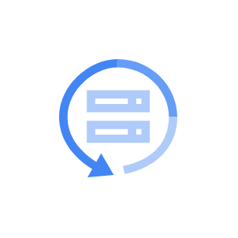

# Gcp2 Operations Entities

- [AnthosServiceMesh](./anthos-service-mesh.md)  

- [BackupAndDr](./backup-and-dr.md)  

- [CloudApis](./cloud-apis.md)  

- [CloudDebugger](./cloud-debugger.md)  

- [CloudLogging](./cloud-logging.md)  

- [CloudMonitoring](./cloud-monitoring.md)  

- [CloudShell](./cloud-shell.md)  

- [CloudBillingApi](./cloud-billing-api.md)  

- [CloudConsole](./cloud-console.md)  

- [CloudDeploymentManager](./cloud-deployment-manager.md)  

- [CloudProfiler](./cloud-profiler.md)  

- [CloudTrace](./cloud-trace.md)  

- [Debugger](./debugger.md)  

- [ErrorReporting](./error-reporting.md)  

- [Stackdriver](./stackdriver.md)  

