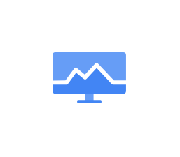

# Cloud
Monitoring

## Definition

```js
{
  _style: {
    entity: 'sketch=0;html=1;verticalAlign=top;labelPosition=center;verticalLabelPosition=bottom;align=center;spacingTop=-6;fontSize=11;fontStyle=1;fontColor=#999999;shape=image;aspect=fixed;imageAspect=0;image=data:image/svg+xml,PHN2ZyB4bWxucz0iaHR0cDovL3d3dy53My5vcmcvMjAwMC9zdmciIHhtbG5zOnY9Imh0dHBzOi8vdmVjdGEuaW8vbmFubyIgd2lkdGg9IjIwIiBoZWlnaHQ9IjEzLjUyOTk5OTczMjk3MTE5MSIgdmlld0JveD0iLTIuOTMyMDk3ODk3ODEyMDE0ZS05IC01LjI1ODAxNTA0MTgzNzk1NmUtMTUgMjAgMTMuNTI5OTk5NzMyOTcxMTkxIj4mI3hhOwk8c3R5bGUgdHlwZT0idGV4dC9jc3MiPiYjeGE7CS5zdDB7ZmlsbDojNDI4NWY0O30mI3hhOwkuc3Qxe2ZpbGw6IzY2OWRmNjt9JiN4YTsJPC9zdHlsZT4mI3hhOwk8cGF0aCBjbGFzcz0ic3QxIiBkPSJNOC44MyAxMC41OGgyLjMzdjIuNjRIOC44M3oiLz4mI3hhOwk8cGF0aCBjbGFzcz0ic3QwIiBkPSJNMTYuNDggOC42MWEuNTYuNTYgMCAwIDEtLjQtLjE3TDEyIDQuMjEgOS4yNiA3LjFhLjU3LjU3IDAgMCAxLS43Ni4wNUw2LjQyIDUuNDdsLTIuMiAyLjkyYS41Ni41NiAwIDAgMS0uNDUuMjJIMHYxLjcxYS43NS43NSAwIDAgMCAuNzQuNzVoMTguNTJhLjc1Ljc1IDAgMCAwIC43NC0uNzVWOC42MXoiLz4mI3hhOwk8cGF0aCBjbGFzcz0ic3QxIiBkPSJNMy41IDcuNWwyLjM4LTMuMTZhLjU1LjU1IDAgMCAxIC4zNy0uMjIuNjMuNjMgMCAwIDEgLjQyLjEybDIuMTIgMS43MiAyLjgtMi45NGEuNTQuNTQgMCAwIDEgLjQtLjE3aDBhLjU0LjU0IDAgMCAxIC40LjE3bDQuMzMgNC40OEgyMFYuNzRhLjc0Ljc0IDAgMCAwLS43NC0uNzRILjc0QS43NC43NCAwIDAgMCAwIC43NHY2LjgxeiIvPiYjeGE7CTxyZWN0IGNsYXNzPSJzdDAiIHg9IjYuNjciIHk9IjEyLjkyIiB3aWR0aD0iNi42NyIgaGVpZ2h0PSIuNjEiIHJ4PSIuMyIvPiYjeGE7PC9zdmc+;strokeColor=none;',
  },
  _width: 42,
  _height: 29,
}
```

## Usage

```js
import { CloudMonitoring } from '@dinghy/standard-components-diagrams/gcp2IconsOperations'

<CloudMonitoring/>
```

## Preview


