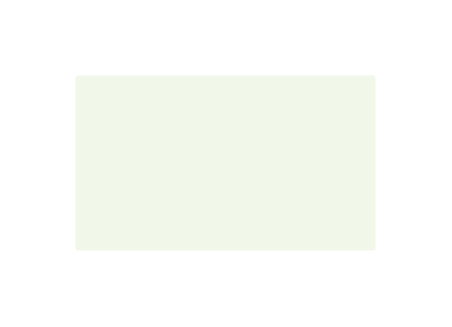
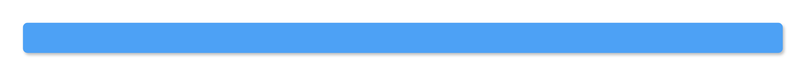

# Gcp2 Zones Entities

- [ColoDcOnPremises](./colo-dc-on-premises.md)  

- [ExternalDataSources](./external-data-sources.md)  

- [ExternalInfrastructure1stParty](./external-infrastructure-1st-party.md)  

- [ExternalInfrastructure3rdParty](./external-infrastructure-3rd-party.md)  

- [ExternalSaasProviders](./external-saas-providers.md)  

- [InfrastructureSystem](./infrastructure-system.md)  

- [Markers](./markers.md)  

- [Markers2](./markers-2.md)  

- [Markers3](./markers-3.md)  

- [Note](./note.md)  

- [ProjectZone](./project-zone.md)  

- [ProjectZoneCloudServiceProvider](./project-zone-cloud-service-provider.md)  

- [System1](./system-1.md)  

- [TitleBar](./title-bar.md)  

- [User1Default](./user-1-default.md)  

