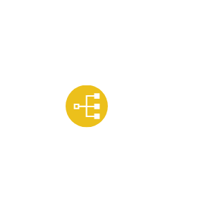

# Ibm Applications Entities

- [ActionableInsight](./actionable-insight.md)  

- [Annotate](./annotate.md)  

- [ApiDeveloperPortal](./api-developer-portal.md)  

- [ApiPolyglotRuntimes](./api-polyglot-runtimes.md)  

- [AppServer](./app-server.md)  

- [ApplicationLogic](./application-logic.md)  

- [AutomationTools](./automation-tools.md)  

- [EnterpriseApplications](./enterprise-applications.md)  

- [IndexApp](./index-app.md)  

- [IotApplication](./iot-application.md)  

- [Microservice](./microservice.md)  

- [MobileApp](./mobile-app.md)  

- [Ontology](./ontology.md)  

- [OpenSourceTools](./open-source-tools.md)  

- [RuntimeServices](./runtime-services.md)  

- [SaasApplications](./saas-applications.md)  

- [ServiceBroker](./service-broker.md)  

- [SpeechToText](./speech-to-text.md)  

- [VisualRecognition](./visual-recognition.md)  

- [Visualization](./visualization.md)  

