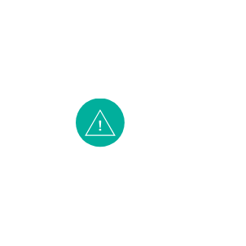

# Ibm Management Entities

- [AlertNotification](./alert-notification.md)  

- [ApiManagement](./api-management.md)  

- [CloudManagement](./cloud-management.md)  

- [ClusterManagement](./cluster-management.md)  

- [ContentManagement](./content-management.md)  

- [DataServices](./data-services.md)  

- [DeviceManagement](./device-management.md)  

- [InformationGovernance](./information-governance.md)  

- [ItServiceManagement](./it-service-management.md)  

- [Management](./management.md)  

- [MonitoringMetrics](./monitoring-metrics.md)  

- [ProcessManagement](./process-management.md)  

- [ProviderCloudPortalService](./provider-cloud-portal-service.md)  

- [PushNotifications](./push-notifications.md)  

- [ServiceManagementTools](./service-management-tools.md)  

