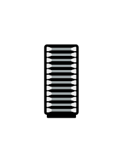

# Mainframe

## Definition

```js
{
  _style: {
    entity: 'fillColorStyles=neutralFill;neutralFill=#9DA6A8;shape=mxgraph.networks2.icon;aspect=fixed;fillColor=#EDEDED;strokeColor=#000000;gradientColor=#5B6163;network2IconShadow=1;network2bgFillColor=none;network2Icon=mxgraph.networks2.mainframe;network2IconW=0.4721;network2IconH=1;',
  },
  _width: 23.605,
  _height: 50,
}
```

## Usage

```js
import { Mainframe } from '@dinghy/standard-components-diagrams/network2'

<Mainframe/>
```

## Preview


