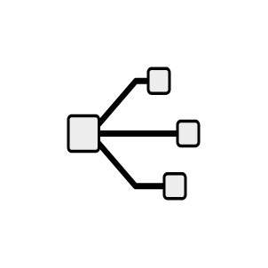

# Network

## Definition

```js
{
  _style: {
    entity: 'shape=mxgraph.networks2.icon;aspect=fixed;fillColor=#EDEDED;strokeColor=#000000;gradientColor=#5B6163;network2IconShadow=1;network2bgFillColor=none;network2Icon=mxgraph.networks2.network;network2IconW=1;network2IconH=0.8601;',
  },
  _original_width: 50,
  _original_height: 43.004999999999995,

}
```

## Usage

```js
import { Network } from '@dinghy/standard-components-diagrams/network2'

<Network/>
```

## Preview


