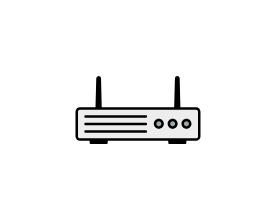

# Router

## Definition

```js
{
  _style: {
    entity: 'fillColorStyles=neutralFill;neutralFill=#9DA6A8;shape=mxgraph.networks2.icon;aspect=fixed;fillColor=#EDEDED;strokeColor=#000000;gradientColor=#5B6163;network2IconShadow=1;network2bgFillColor=none;network2Icon=mxgraph.networks2.router;network2IconXOffset=0.0001;network2IconYOffset=-0.1142;network2IconW=1;network2IconH=0.5485;',
  },
  _width: 50,
  _height: 27.425,
}
```

## Usage

```js
import { Router } from '@dinghy/standard-components-diagrams/network2'

<Router/>
```

## Preview


