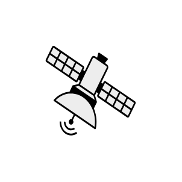

# Satellite

## Definition

```js
{
  _style: {
    entity: 'shape=mxgraph.networks2.icon;aspect=fixed;fillColor=#EDEDED;strokeColor=#000000;gradientColor=#5B6163;network2IconShadow=1;network2bgFillColor=none;network2Icon=mxgraph.networks2.satellite;network2IconXOffset=0.0149;network2IconYOffset=-0.00046;network2IconW=1.1553;network2IconH=0.9741;',
  },
  _original_width: 57.765,
  _original_height: 48.705,

}
```

## Usage

```js
import { Satellite } from '@dinghy/standard-components-diagrams/network2'

<Satellite/>
```

## Preview


