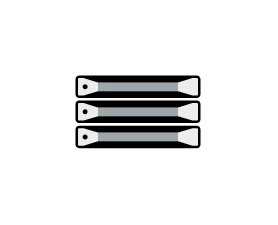

# Server

## Definition

```js
{
  _style: {
    entity: 'fillColorStyles=neutralFill;neutralFill=#9DA6A8;shape=mxgraph.networks2.icon;aspect=fixed;fillColor=#EDEDED;strokeColor=#000000;gradientColor=#5B6163;network2IconShadow=1;network2bgFillColor=none;network2Icon=mxgraph.networks2.server;network2IconW=1.0001;network2IconH=0.5812;',
  },
  _width: 50.005,
  _height: 29.060000000000002,
}
```

## Usage

```js
import { Server } from '@dinghy/standard-components-diagrams/network2'

<Server/>
```

## Preview


