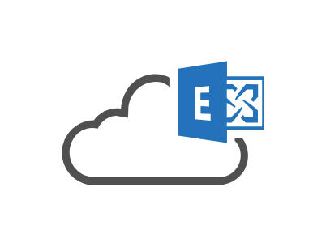
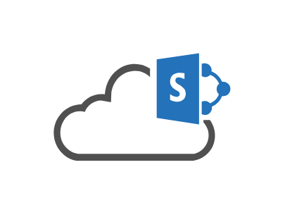

# Office Clouds Entities

- [Azure](./azure.md)  

- [Cloud](./cloud.md)  

- [CloudDisaster](./cloud-disaster.md)  

- [CloudDisasterRed](./cloud-disaster-red.md)  

- [CloudExchangeOnline](./cloud-exchange-online.md)  

- [CloudServiceRequest](./cloud-service-request.md)  

- [CloudSharepoint](./cloud-sharepoint.md)  

- [Office365](./office-365.md)  

- [OnlineBackup](./online-backup.md)  

- [OnlineUser](./online-user.md)  

- [PrivateCloud](./private-cloud.md)  

- [PublicCloud](./public-cloud.md)  

- [PublicImCloudService](./public-im-cloud-service.md)  

