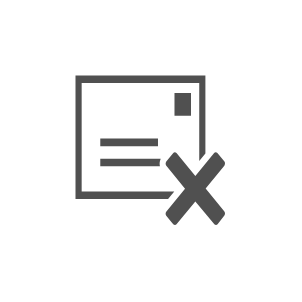

# Email Rejected

## Definition

```js
{
  _style: {
    entity: 'sketch=0;pointerEvents=1;shadow=0;dashed=0;html=1;strokeColor=none;fillColor=#505050;labelPosition=center;verticalLabelPosition=bottom;verticalAlign=top;outlineConnect=0;align=center;shape=mxgraph.office.concepts.email_rejected;',
  },
  _original_width: 55,
  _original_height: 45,

}
```

## Usage

```js
import { EmailRejected } from '@dinghy/standard-components-diagrams/officeConcepts'

<EmailRejected/>
```

## Preview


