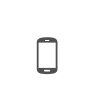
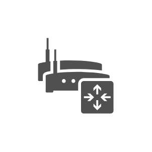
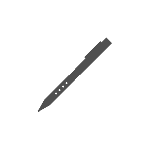
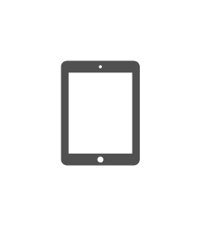
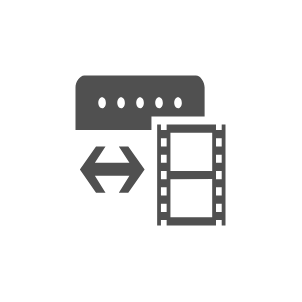

# Office Devices Entities

- [Bluetooth](./bluetooth.md)  

- [CdDvd](./cd-dvd.md)  

- [CellPhoneAndroidProportional](./cell-phone-android-proportional.md)  

- [CellPhoneAndroidStandalone](./cell-phone-android-standalone.md)  

- [CellPhoneGeneric](./cell-phone-generic.md)  

- [CellPhoneIphoneProportional](./cell-phone-iphone-proportional.md)  

- [CellPhoneIphoneStandalone](./cell-phone-iphone-standalone.md)  

- [CellPhoneWindowsPhoneProportional](./cell-phone-windows-phone-proportional.md)  

- [CellPhoneWindowsPhoneStandalone](./cell-phone-windows-phone-standalone.md)  

- [DataJack](./data-jack.md)  

- [DeviceUpdateService](./device-update-service.md)  

- [Fax](./fax.md)  

- [HardDisk](./hard-disk.md)  

- [Headset](./headset.md)  

- [IpGateway](./ip-gateway.md)  

- [IpPbx](./ip-pbx.md)  

- [IpadMini](./ipad-mini.md)  

- [Laptop](./laptop.md)  

- [LcdMonitor](./lcd-monitor.md)  

- [LoadBalancer](./load-balancer.md)  

- [MacClient](./mac-client.md)  

- [ManagementConsole](./management-console.md)  

- [Microphone](./microphone.md)  

- [Modem](./modem.md)  

- [Nic](./nic.md)  

- [PhoneDigital](./phone-digital.md)  

- [PhoneTraditional](./phone-traditional.md)  

- [PhoneUsb](./phone-usb.md)  

- [PhoneVoip](./phone-voip.md)  

- [Printer](./printer.md)  

- [Roundtable](./roundtable.md)  

- [Router](./router.md)  

- [SessionBorderController](./session-border-controller.md)  

- [ShadowedRouter](./shadowed-router.md)  

- [Stylus](./stylus.md)  

- [Switch](./switch.md)  

- [TabletAndroid](./tablet-android.md)  

- [TabletIpad](./tablet-ipad.md)  

- [TabletWindows8](./tablet-windows-8.md)  

- [TabletWindows7inch](./tablet-windows-7inch.md)  

- [Tv](./tv.md)  

- [VideoCamera](./video-camera.md)  

- [VideoGateway](./video-gateway.md)  

- [Webcam](./webcam.md)  

- [WebcamHd](./webcam-hd.md)  

- [Workstation](./workstation.md)  

- [WorkstationPc](./workstation-pc.md)  

- [WorkstationVisualStudio](./workstation-visual-studio.md)  

