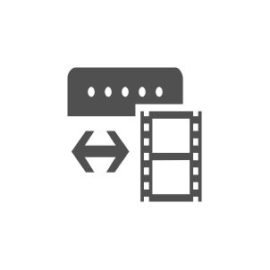

# Video Gateway

## Definition

```js
{
  _style: {
    entity: 'sketch=0;pointerEvents=1;shadow=0;dashed=0;html=1;strokeColor=none;fillColor=#505050;labelPosition=center;verticalLabelPosition=bottom;verticalAlign=top;outlineConnect=0;align=center;shape=mxgraph.office.devices.video_gateway;',
  },
  _original_width: 59,
  _original_height: 41,

}
```

## Usage

```js
import { VideoGateway } from '@dinghy/standard-components-diagrams/officeDevices'

<VideoGateway/>
```

## Preview


