# Rack Cisco Entities

- [Cisco1905SerialIntegratedServicesRouter](./cisco-1905-serial-integrated-services-router.md)  
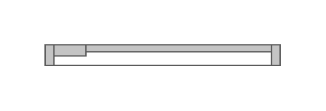

- [Cisco1921IntegratedServicesRouter](./cisco-1921-integrated-services-router.md)  
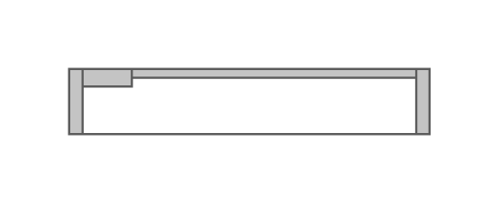

- [Cisco1941SeriesIntegratedServicesRouter](./cisco-1941-series-integrated-services-router.md)  
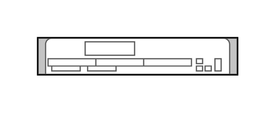

- [Cisco2901IntegratedServicesRouter](./cisco-2901-integrated-services-router.md)  
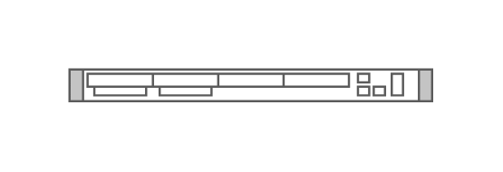

- [Cisco2911IntegratedServicesRouter](./cisco-2911-integrated-services-router.md)  
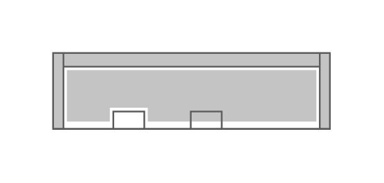

- [Cisco2921IntegratedServicesRouter](./cisco-2921-integrated-services-router.md)  
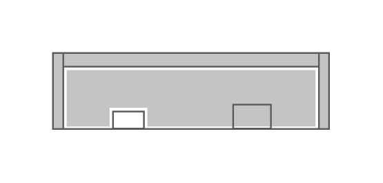

- [Cisco2951IntegratedServicesRouter](./cisco-2951-integrated-services-router.md)  

- [Cisco3925IntegratedServicesRouter](./cisco-3925-integrated-services-router.md)  
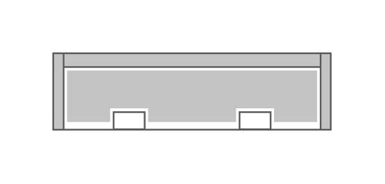

- [Cisco3945IntegratedServicesRouter](./cisco-3945-integrated-services-router.md)  

- [Cisco7603Router](./cisco-7603-router.md)  
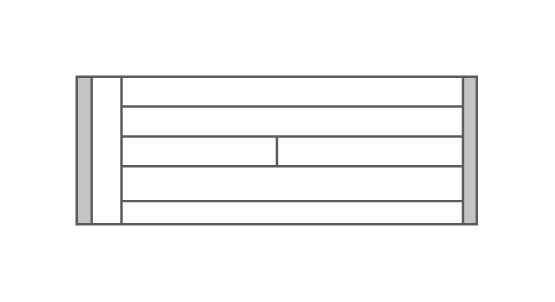

- [Cisco7604Router](./cisco-7604-router.md)  
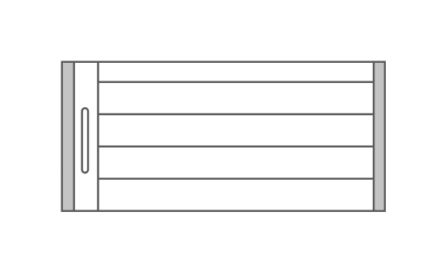

- [Cisco7606Router](./cisco-7606-router.md)  

- [Cisco7609Router](./cisco-7609-router.md)  
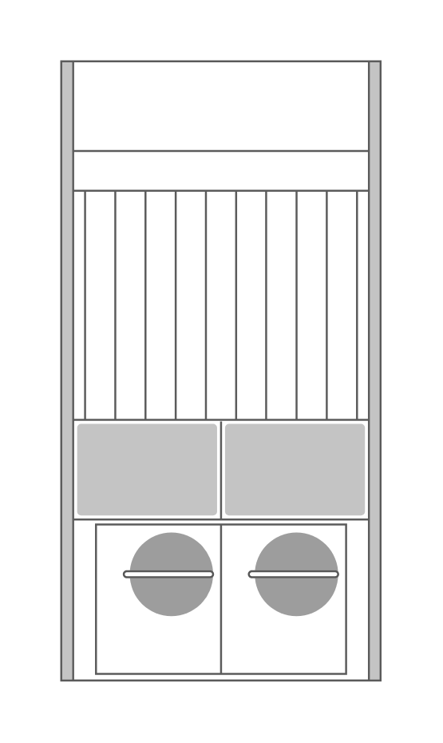

- [Cisco7613Router](./cisco-7613-router.md)  
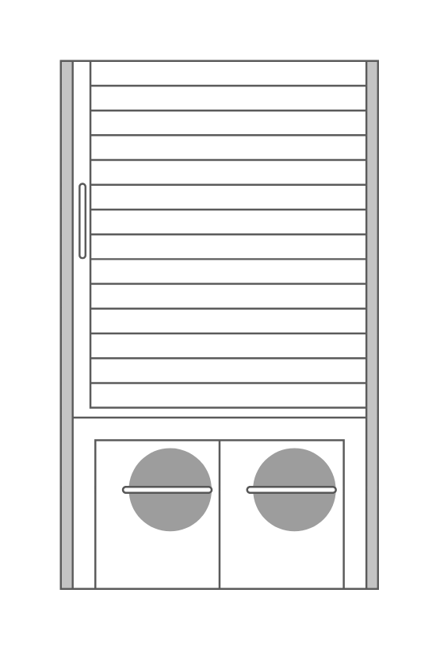

- [Cisco8340ApplicationOrientedNetworkingAppliance](./cisco-8340-application-oriented-networking-appliance.md)  
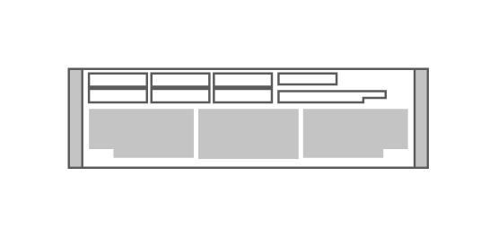

- [CiscoAsa5585XAdaptiveSecurityAppliance](./cisco-asa-5585-x-adaptive-security-appliance.md)  
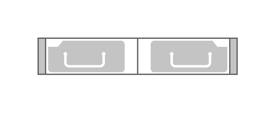

- [CiscoAsr1001Router](./cisco-asr-1001-router.md)  
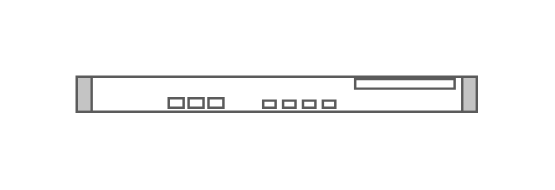

- [CiscoAsr1002Router](./cisco-asr-1002-router.md)  
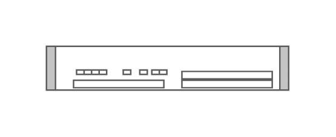

- [CiscoAsr1002XRouter](./cisco-asr-1002-x-router.md)  
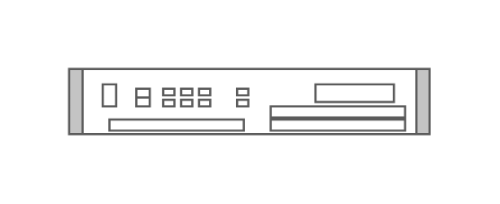

- [CiscoAsr1004Router](./cisco-asr-1004-router.md)  
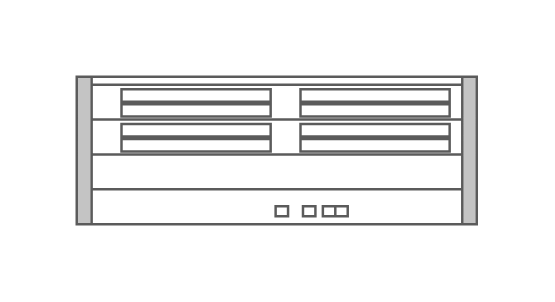

- [CiscoAsr1006Router](./cisco-asr-1006-router.md)  
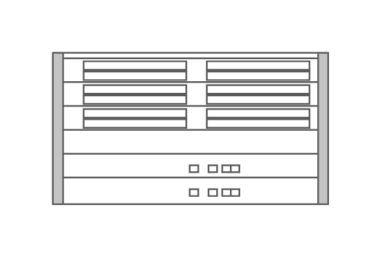

- [CiscoAsr1013Router](./cisco-asr-1013-router.md)  

- [CiscoAsr9001](./cisco-asr-9001.md)  
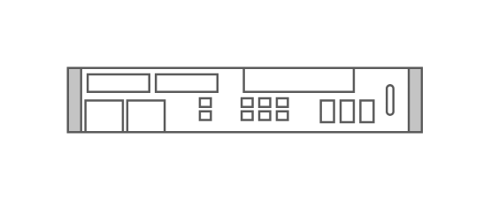

- [CiscoAsr9006](./cisco-asr-9006.md)  
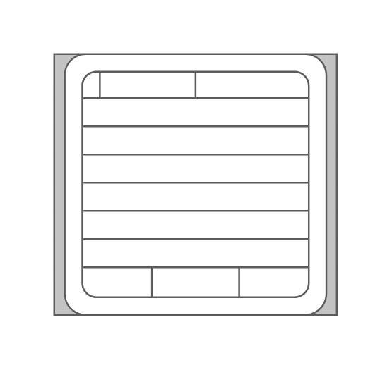

- [CiscoAsr9010](./cisco-asr-9010.md)  
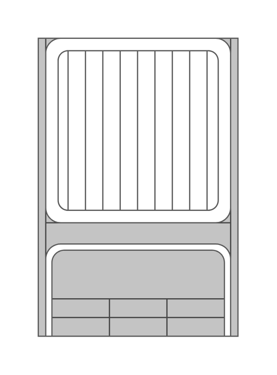

- [CiscoAsr9922](./cisco-asr-9922.md)  

- [CiscoBladeSwitch3030](./cisco-blade-switch-3030.md)  

- [CiscoCarrierPacketTransport200](./cisco-carrier-packet-transport-200.md)  
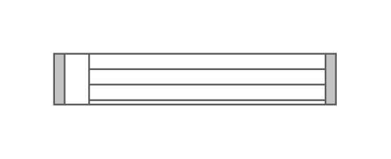

- [CiscoCarrierPacketTransport50](./cisco-carrier-packet-transport-50.md)  
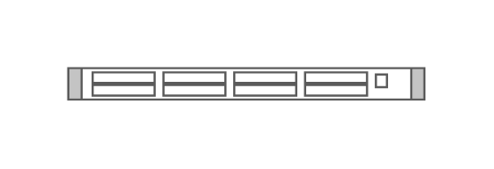

- [CiscoCarrierPacketTransport600](./cisco-carrier-packet-transport-600.md)  
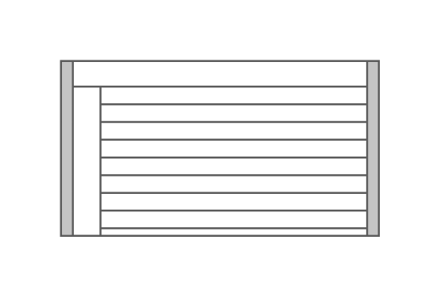

- [CiscoCatalyst4900mSwitch](./cisco-catalyst-4900m-switch.md)  
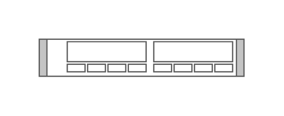

- [CiscoCatalyst492810GigabitEthernetSwitch](./cisco-catalyst-4928-10-gigabit-ethernet-switch.md)  
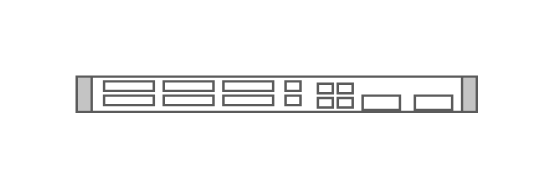

- [CiscoCatalyst494810GigabitEthernetSwitch](./cisco-catalyst-4948-10-gigabit-ethernet-switch.md)  

- [CiscoCatalyst4948Switch](./cisco-catalyst-4948-switch.md)  

- [CiscoCatalyst6503ESwitch](./cisco-catalyst-6503-e-switch.md)  
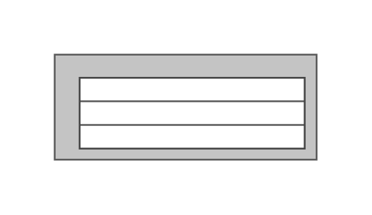

- [CiscoCatalyst6504ESwitch](./cisco-catalyst-6504-e-switch.md)  
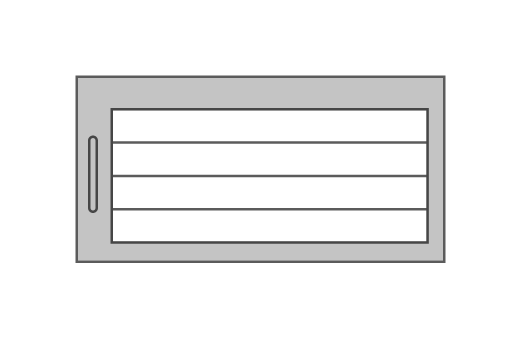

- [CiscoCatalyst6506ESwitch](./cisco-catalyst-6506-e-switch.md)  
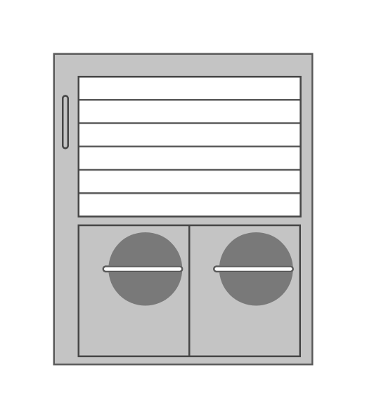

- [CiscoCatalyst6509Switch](./cisco-catalyst-6509-switch.md)  
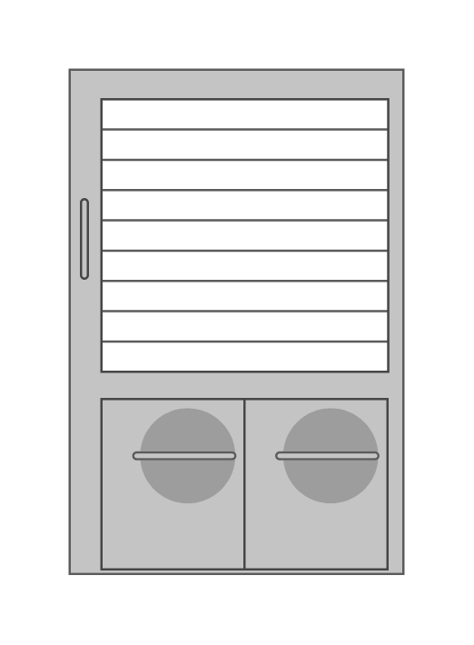

- [CiscoCatalyst6513E](./cisco-catalyst-6513-e.md)  
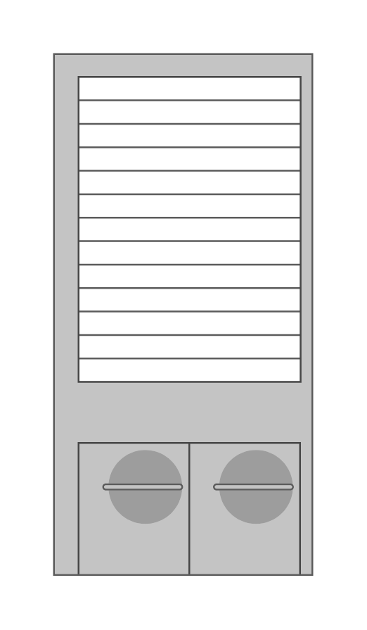

- [CiscoCatalystBladeSwitch3020ForHp](./cisco-catalyst-blade-switch-3020-for-hp.md)  
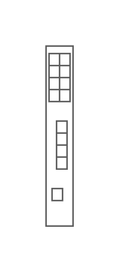

- [CiscoCatalystBladeSwitch3032ForDell](./cisco-catalyst-blade-switch-3032-for-dell.md)  

- [CiscoCatalystBladeSwitch3040ForDell](./cisco-catalyst-blade-switch-3040-for-dell.md)  
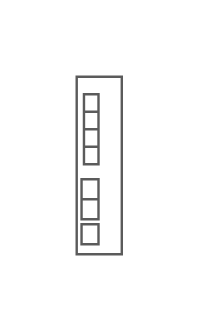

- [CiscoCatalystBladeSwitch3100ForDell](./cisco-catalyst-blade-switch-3100-for-dell.md)  

- [CiscoCatalystBladeSwitch3120ForHp](./cisco-catalyst-blade-switch-3120-for-hp.md)  
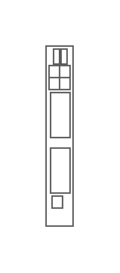

- [CiscoCatalystBladeSwitch3130ForDell](./cisco-catalyst-blade-switch-3130-for-dell.md)  

- [CiscoIdentityServicesEngine](./cisco-identity-services-engine.md)  
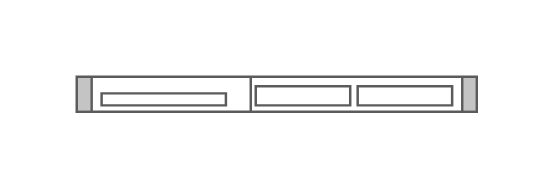

- [CiscoIps4500Sensor](./cisco-ips-4500-sensor.md)  
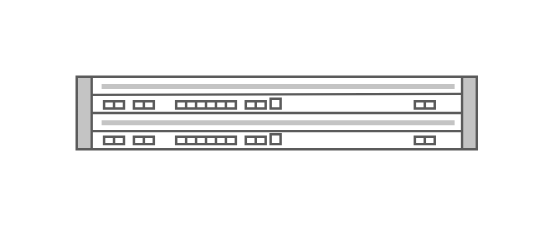

- [CiscoNetworkAccessControl](./cisco-network-access-control.md)  
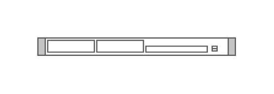

- [CiscoNexus1010VirtualServicesAppliance](./cisco-nexus-1010-virtual-services-appliance.md)  
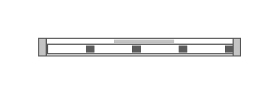

- [CiscoNexus2148tFabricExtender](./cisco-nexus-2148t-fabric-extender.md)  
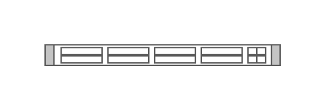

- [CiscoNexus2224tpGeFabricExtender](./cisco-nexus-2224tp-ge-fabric-extender.md)  
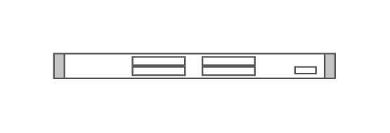

- [CiscoNexus2232pp10geFabricExtender](./cisco-nexus-2232pp-10ge-fabric-extender.md)  
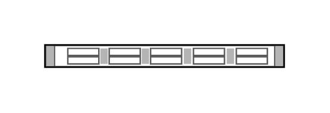

- [CiscoNexus2232tm10geFabricExtender](./cisco-nexus-2232tm-10ge-fabric-extender.md)  
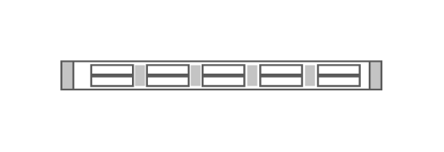

- [CiscoNexus2248pq10geFabricExtender](./cisco-nexus-2248pq-10ge-fabric-extender.md)  
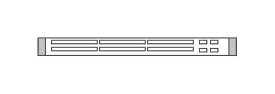

- [CiscoNexus2248tpGeFabricExtender](./cisco-nexus-2248tp-ge-fabric-extender.md)  

- [CiscoNexus3016Switch](./cisco-nexus-3016-switch.md)  
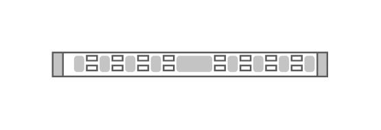

- [CiscoNexus3048Switch](./cisco-nexus-3048-switch.md)  

- [CiscoNexus3064Switch](./cisco-nexus-3064-switch.md)  
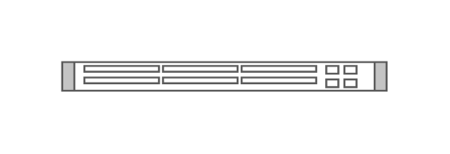

- [CiscoNexus3548Switch](./cisco-nexus-3548-switch.md)  
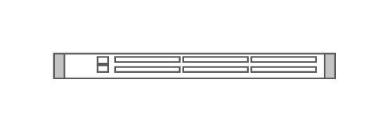

- [CiscoNexus5548pSwitch](./cisco-nexus-5548p-switch.md)  
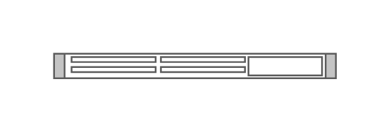

- [CiscoNexus5596t](./cisco-nexus-5596t.md)  
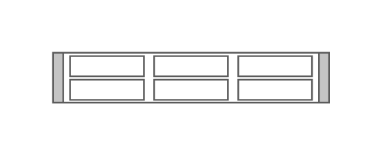

- [CiscoNexus5596upSwitch](./cisco-nexus-5596up-switch.md)  
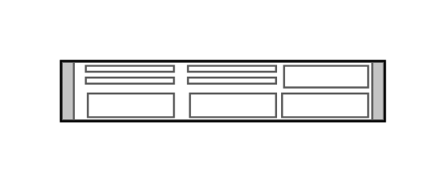

- [CiscoNexus6001Switch](./cisco-nexus-6001-switch.md)  
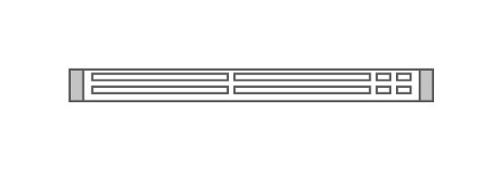

- [CiscoNexus6004Switch](./cisco-nexus-6004-switch.md)  

- [CiscoNexus700010SlotSwitchChassis](./cisco-nexus-7000-10-slot-switch-chassis.md)  

- [CiscoNexus700018SlotSwitchChassis](./cisco-nexus-7000-18-slot-switch-chassis.md)  

- [CiscoNexus70004SlotSwitchChassis](./cisco-nexus-7000-4-slot-switch-chassis.md)  

- [CiscoNexus70009SlotSwitchChassis](./cisco-nexus-7000-9-slot-switch-chassis.md)  

- [CiscoOns15305MultiserviceCustomerAccessPlatform](./cisco-ons-15305-multiservice-customer-access-platform.md)  

- [CiscoOns15310ClSonetMultiservicePlatform](./cisco-ons-15310-cl-sonet-multiservice-platform.md)  

- [CiscoOns15310MaSdhMultiservicePlatform](./cisco-ons-15310-ma-sdh-multiservice-platform.md)  

- [CiscoOns15454SonetSdhMultiserviceProvisioningPlatform](./cisco-ons-15454-sonet-sdh-multiservice-provisioning-platform.md)  

- [CiscoOns15600MultiserviceSwitchingPlatform](./cisco-ons-15600-multiservice-switching-platform.md)  

- [CiscoPhysicalSecurity4uStorage](./cisco-physical-security-4u-storage.md)  

- [CiscoPhysicalSecurityMultiservicePlatform1u](./cisco-physical-security-multiservice-platform-1u.md)  

- [CiscoPhysicalSecurityMultiservicePlatform2u](./cisco-physical-security-multiservice-platform-2u.md)  

- [CiscoPhysicalSecurityMultiservicePlatform4u](./cisco-physical-security-multiservice-platform-4u.md)  

- [CiscoUcs5100Chassis](./cisco-ucs-5100-chassis.md)  

- [CiscoUcs6248upFabricInterconnect](./cisco-ucs-6248up-fabric-interconnect.md)  

- [CiscoUcs6296upFabricInterconnect](./cisco-ucs-6296up-fabric-interconnect.md)  

- [CiscoUcsC22M3Server](./cisco-ucs-c22-m3-server.md)  

- [CiscoUcsC220M3Server](./cisco-ucs-c220-m3-server.md)  

- [CiscoUcsC24M3Server](./cisco-ucs-c24-m3-server.md)  

- [CiscoUcsC240M3Server](./cisco-ucs-c240-m3-server.md)  

- [CiscoUcsC260M3Server](./cisco-ucs-c260-m3-server.md)  

- [CiscoUcsC420M3Server](./cisco-ucs-c420-m3-server.md)  

- [CiscoUcsC460M2Server](./cisco-ucs-c460-m2-server.md)  

- [CiscoWae512](./cisco-wae-512.md)  

- [CiscoWae612](./cisco-wae-612.md)  

- [CiscoWae674](./cisco-wae-674.md)  

- [CiscoWae7341](./cisco-wae-7341.md)  

- [CiscoWae7371](./cisco-wae-7371.md)  

- [CiscoWave294](./cisco-wave-294.md)  

- [CiscoWave594](./cisco-wave-594.md)  

- [CiscoWave694](./cisco-wave-694.md)  

- [CiscoWave7541](./cisco-wave-7541.md)  

- [CiscoWave7571](./cisco-wave-7571.md)  

- [CiscoWave8541](./cisco-wave-8541.md)  

- [CiscoWebSecurityApplianceS170](./cisco-web-security-appliance-s170.md)  

- [CiscoWebSecurityApplianceS370](./cisco-web-security-appliance-s370.md)  

- [CiscoWebSecurityApplianceS670](./cisco-web-security-appliance-s670.md)  

