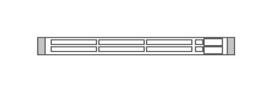

# Cisco Catalyst 4948 10 Gigabit Ethernet Switch

## Definition

```js
{
  _style: {
    entity: 'shape=mxgraph.rack.cisco.cisco_catalyst_4948_10_gigabit_ethernet_switch;html=1;labelPosition=right;align=left;spacingLeft=15;dashed=0;shadow=0;fillColor=#ffffff;',
  },
  _width: 161,
  _height: 15,
}
```

## Usage

```js
import { CiscoCatalyst494810GigabitEthernetSwitch } from '@dinghy/standard-components-diagrams/rackCisco'

<CiscoCatalyst494810GigabitEthernetSwitch/>
```

## Preview


