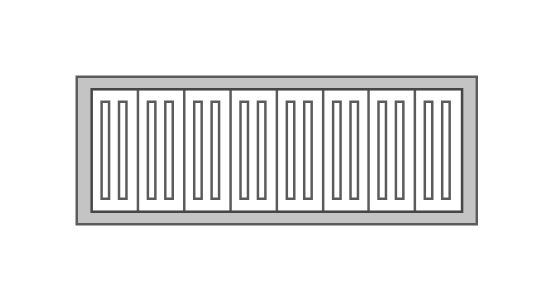

# Cisco Nexus 6004 Switch

## Definition

```js
{
  _style: {
    entity: 'shape=mxgraph.rack.cisco.cisco_nexus_6004_switch;html=1;labelPosition=right;align=left;spacingLeft=15;dashed=0;shadow=0;fillColor=#ffffff;',
  },
  _width: 161,
  _height: 60,
}
```

## Usage

```js
import { CiscoNexus6004Switch } from '@dinghy/standard-components-diagrams/rackCisco'

<CiscoNexus6004Switch/>
```

## Preview


