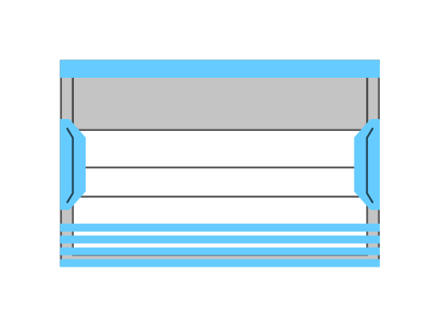

# Cisco Nexus 7000 4-Slot Switch Chassis

## Definition

```js
{
  _style: {
    entity: 'shape=mxgraph.rack.cisco.cisco_nexus_7000_4-slot_switch_chassis;html=1;labelPosition=right;align=left;spacingLeft=15;dashed=0;shadow=0;fillColor=#ffffff;',
  },
  _width: 161,
  _height: 104,
}
```

## Usage

```js
import { CiscoNexus70004SlotSwitchChassis } from '@dinghy/standard-components-diagrams/rackCisco'

<CiscoNexus70004SlotSwitchChassis/>
```

## Preview


