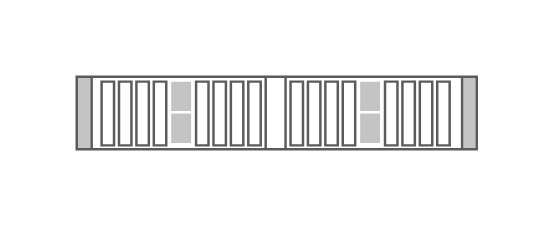

# Cisco UCS C260 M3 Server

## Definition

```js
{
  _style: {
    entity: 'shape=mxgraph.rack.cisco.cisco_ucs_c260_m3_server;html=1;labelPosition=right;align=left;spacingLeft=15;dashed=0;shadow=0;fillColor=#ffffff;',
  },
  _width: 161,
  _height: 30,
}
```

## Usage

```js
import { CiscoUcsC260M3Server } from '@dinghy/standard-components-diagrams/rackCisco'

<CiscoUcsC260M3Server/>
```

## Preview


